# Laporan Praktikum #10 - Polimorfisme

TRI FUAD
## Kompetensi
Setelah menyelesaikan lembar kerja ini mahasiswa diharapkan mampu: 

a. Memahami konsep dan bentuk dasar polimorfisme 

b. Memahami konsep virtual method invication 

c. Menerapkan polimorfisme pada pembuatan heterogeneous collection 

d. Menerapkan polimorfisme pada parameter/argument method 

e. Menerapkan object casting untuk meng-ubah bentuk objek 

## Ringkasan Materi

untuk keseluruhan dalam menyelesaikan tugas yang di berikan dosen tidak ada masalah, mulai terbiasa dengan cara pengiriman 

## Praktikum

### Percobaan 1

Class Employee
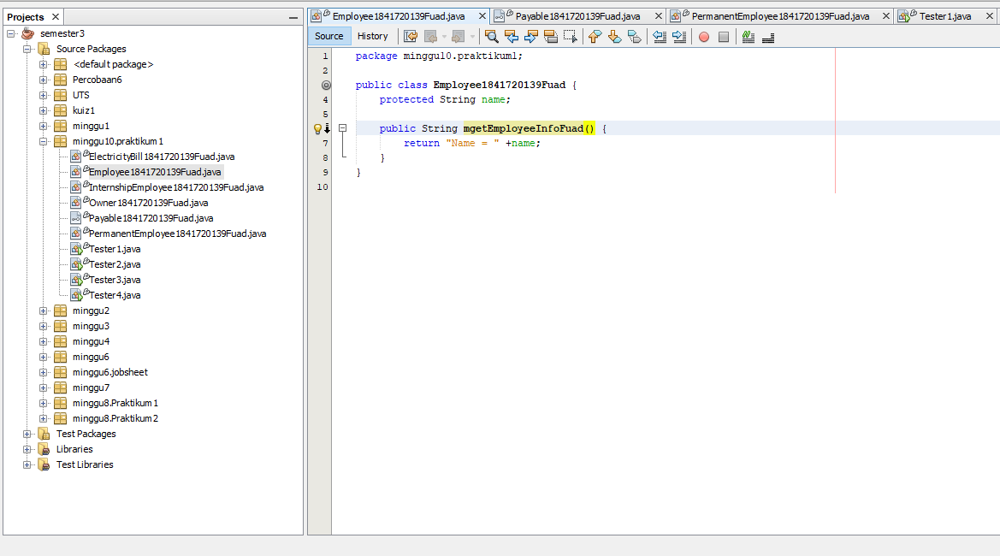

Link kode program : 
[Employee](../../src/10_Polimorfisme/Employee1841720139Fuad.java)

Class Payable
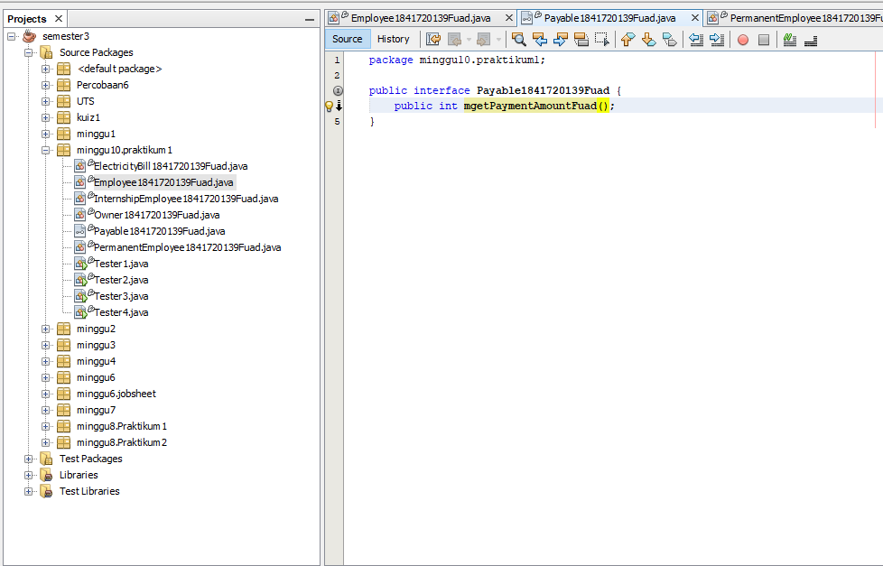

Link kode program : 
[Payable](../../src/10_Polimorfisme/Payable1841720139Fuad.java)

Class InternshipEmployee
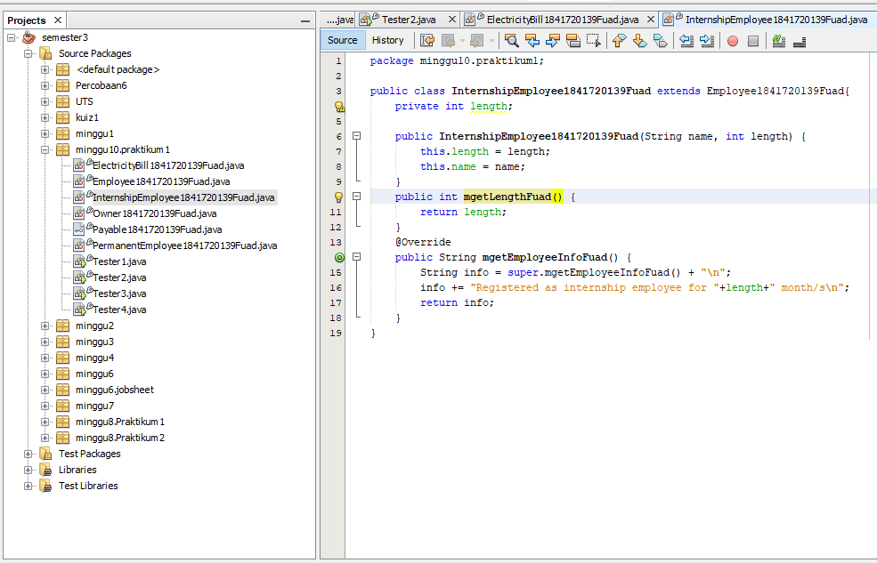

Link kode program : 
[InternshipEmployee](../../src/10_Polimorfisme/InternshipEmployee1841720139Fuad.java)

Class PermanentEmployee
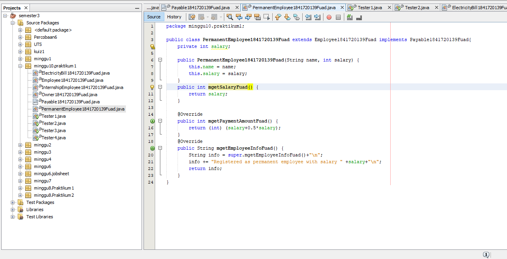

Link kode program : 
[PermanentEmployee](../../src/10_Polimorfisme/PermanentEmployee1841720139Fuad.java)

Class ElectricityBill
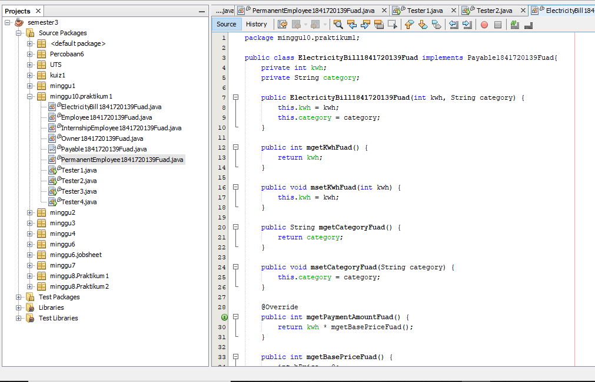
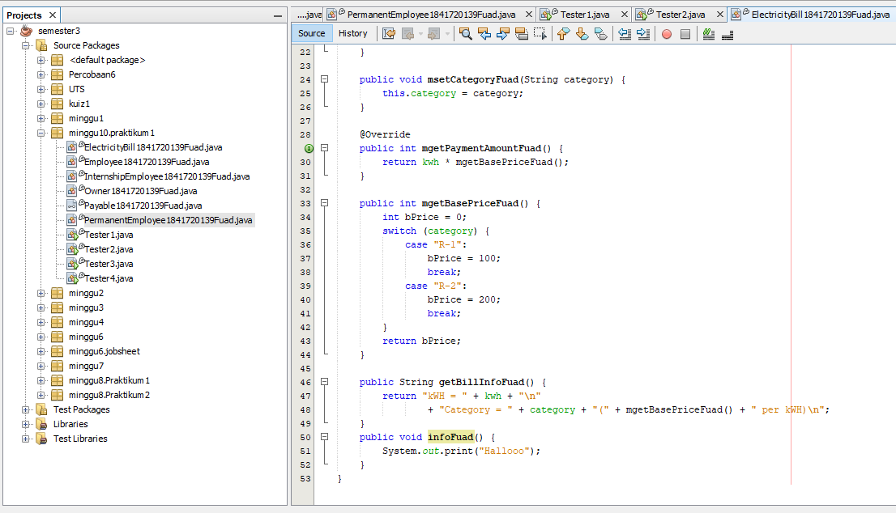

Link kode program : 
[ElectricityBill](../../src/10_Polimorfisme/ElectricityBill1841720139Fuad.java)

Class Tester1
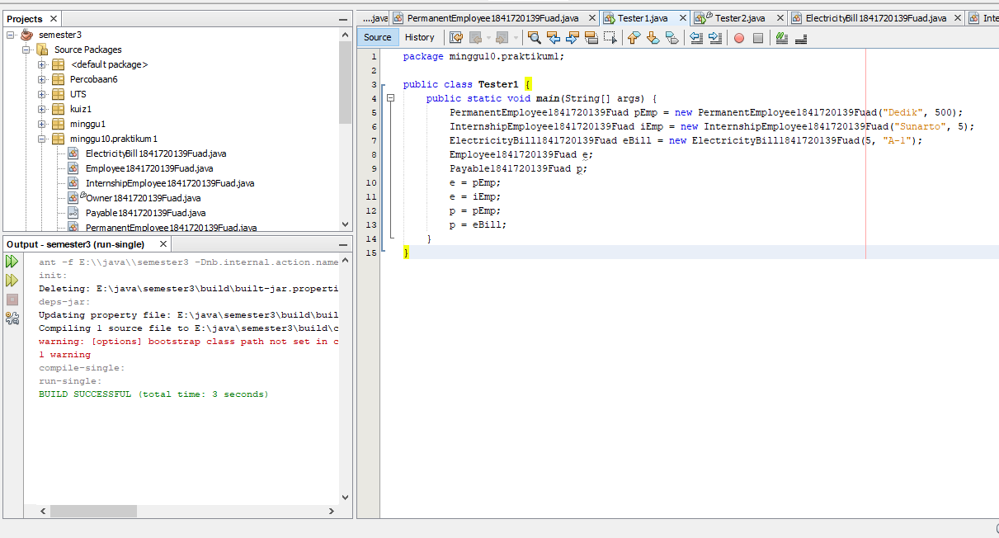

Link kode program : 
[Tester1](../../src/10_Polimorfisme/Tester1.java

#### Pertanyaan
1. Class **InternshipEmployee** dan **PermanentEmployee** merupakan turunan dari class **Employee**
2. Class **PermanentEmployee** dan class **ElectricityBill** merupakan class yang _implements_ ke interface **Payable**
3. karena keduanya memiliki superclass yang sama sehingga bisa mengisi **e** yang merupakan instansiasi dari class **Employee** yang merupakan superclass dari **PermanentEmployee** dan **InternshipEmployee**

4. karena kedua objek tersebut sama sama meng-_implements_ interface **Payable** yang merupakan interface dari objek **p**

5. Error terjadi karena objek **p** tidak meng*extends* class **Employee** yang merupakan superclass dari **InternshipEmployee** dan objek **e** tidak meng*implements* interface **Payable** 

6. Kesimpulannya adalah objek bisa dimasukkan ke dalam array heterogen dan di*casting* jika sama superclassnya. 
### Percobaan 2
Class Tester2
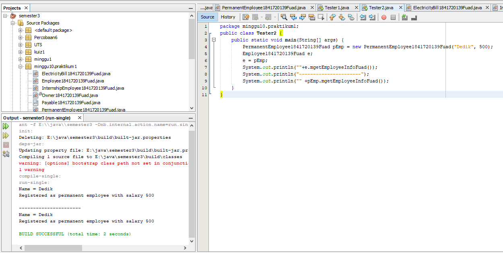

Link kode program : 
[Tester2](../../src/10_Polimorfisme/Tester2.java)

#### Pertanyaan
1. Karena terjadi perubahan tipe data atau bida disebut casting objek. Dimana tipe data objek e sebelumnya adalah **Employee** berubah menjadi tipe data **PermanentEmployee** sehingga terjadi overriding method, yang artinya pada saat compile time, method yang terbaca saat *compiling* adalah method pada class **Employee** sedangkan pada saar *run time* adalah method pada class **PermanentEmployee**

2. Karena adanya perubahan tipe data pada objek **e** tadi pada perintah e = pEmp. Yang awalnya objek **e** bertipe data **Employee** menjadi tipe data **PermanentEmployee** atau bisa disebut casting

3. Virtual method invocation terjadi ketika ada pemanggilan overriding method
dari suatu objek polimorfisme. Disebut virtual karena antara method yang
dikenali oleh compiler dan method yang dijalankan oleh JVM (_Java Virtual Machine_) berbeda 

### Percobaan 3
Class Tester3
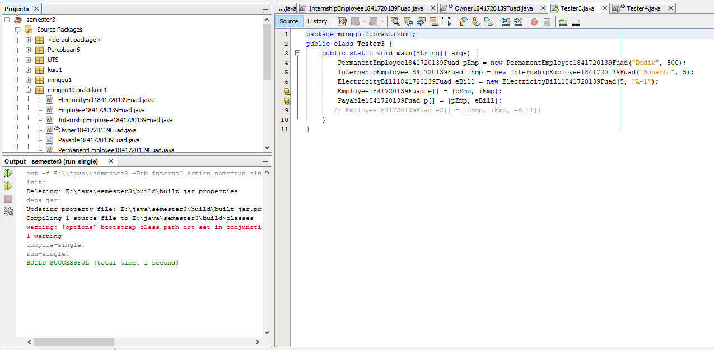

Link kode program : 
[Tester3](../../src/10_Polimorfisme/Tester3.java)

#### Pertanyaan
1. objek **e** bisa diisi dengan objek bertipedata beda karena kedua objek tersebut (**pEmp** dan **iEmp**) memiliki superclass yang sama dengan tipedata objek **e** yaitu **Employee**.

2. objek **p** juga sama karena kedua objek memiliki superclass yang sama yaitu **Payable**

3. Karena ada objek yang memiliki lain superclass dengan objek array yang menampung sehingga terjadi error. Dilihat dari fungsi array sendiri yaitu menampung data yang bertipe data sama.
   
### Percobaan 4
Class Owner
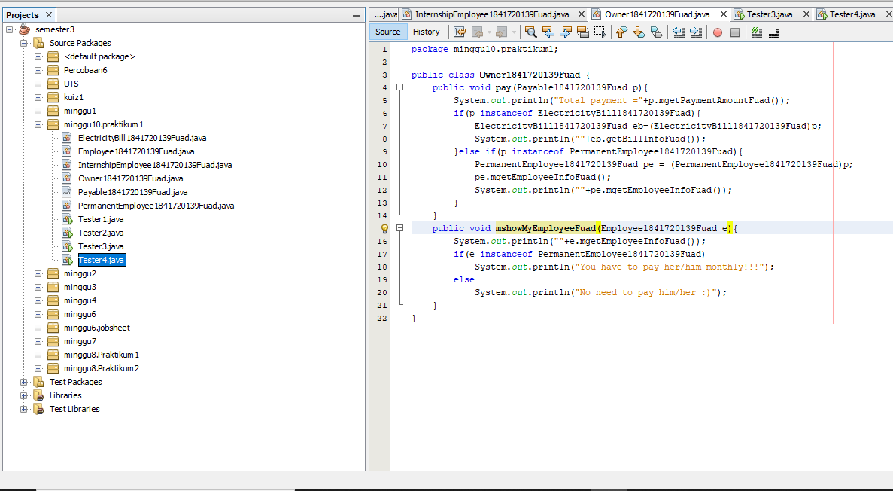

Link kode program : 
[Owner](../../src/10_Polimorfisme/Owner1841720139Fuad.java)

Class Tester4
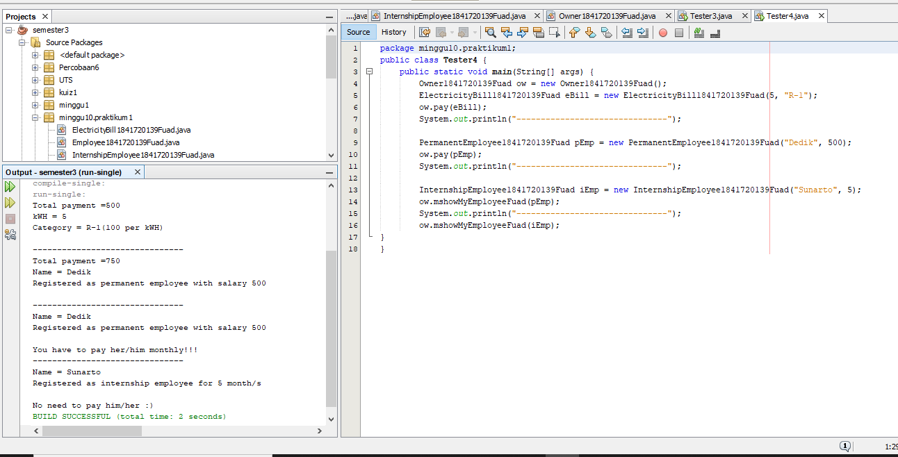

Link kode program : 
[Tester4](../../src/10_Polimorfisme/Tester4.java)

#### Pertanyaan
1. keduanya bisa dipanggil karena keduanya sama sama meng*implements* interface **Payable**.

2. Agar class yang mengimplements **Payable** isa dipanggil semua tanpa terkecuali.

3. karena objek **iEmp** tidak meng*implements* interface Payable sehingga ada ketidak cocokan tipe data yang ada pada objek dengan tipe data parameter.

4. untuk dilakukan pengecekan apakah ada hubungan antara objek **p** yang merupakan hasil instansiasi dari interface **Payable** terhadap class **ElectricityBill**. Jika ElectricityBill merupakan hasil implements dari interface Payable maka akan muncul hasil true, jika tidak maka false.

5. Agar bisa memanggil method pada class **ElectricityBill**, karena sebelumnya belum ada instansiasi objek **eb** pada class **Owner** sehingga harus dilakukan casting terhadap objek **p** sebagai penampung dari class lain yang meng*imlements* dirinya (interface **Payable**). Jika dilakukan instansiasi terhadap **ElectricityBill** sendiri maka harus mengisi data baru karena terdapat konstruktor berparameter pada class **ElectrocotyBill**

### Tugas
Class Zombie
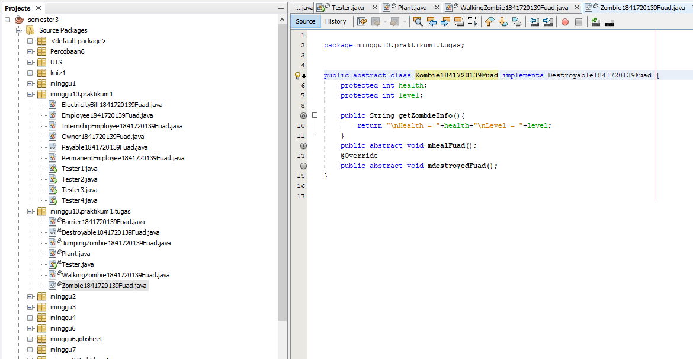

Link kode program : 
[Zombie](../../src/10_Polimorfisme/Zombie1841720139Fuad.java)

Class WalkingZombie
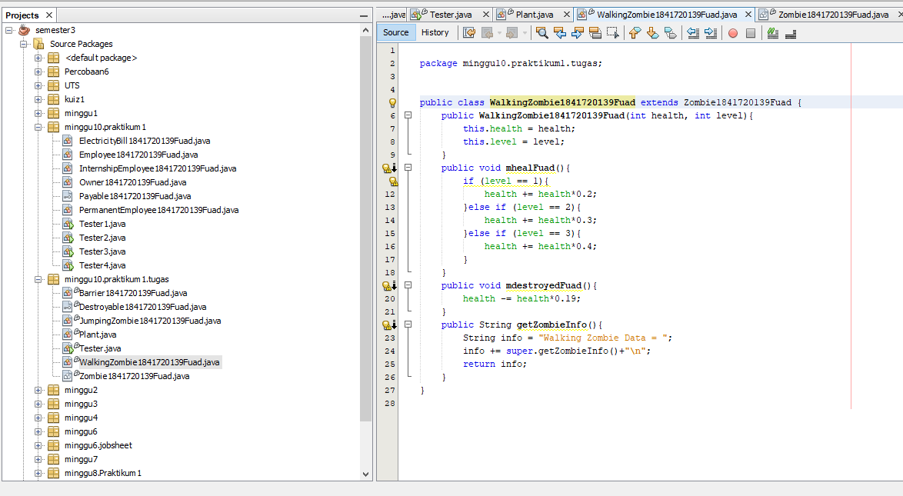

Link kode program : 
[WalkingZombie](../../src/10_Polimorfisme/WalkingZombie1841720139Fuad.java)

Class JumpingZombie
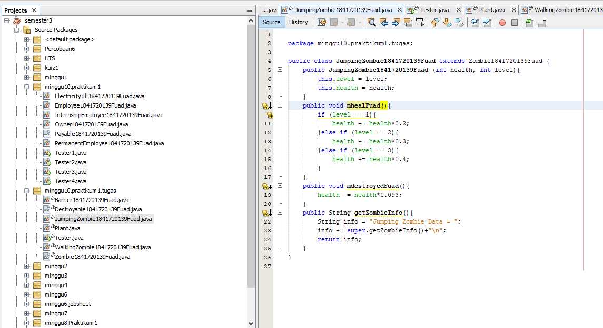

Link kode program : 
[JumpuingZombie](../../src/10_Polimorfisme/JumpingZombie1841720139Fuad.java)

Class Destroyable
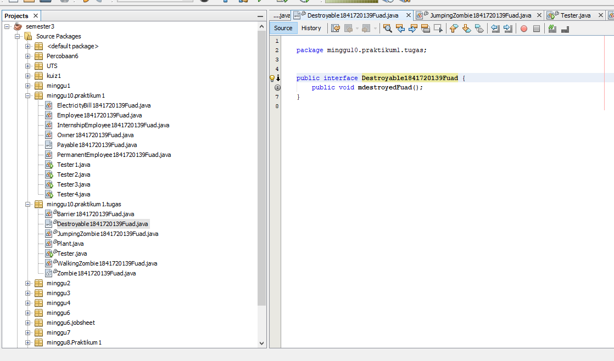

Link kode program : 
[Destroyable](../../src/10_Polimorfisme/Destroyable1841720139Fuad.java)

Class Barrier
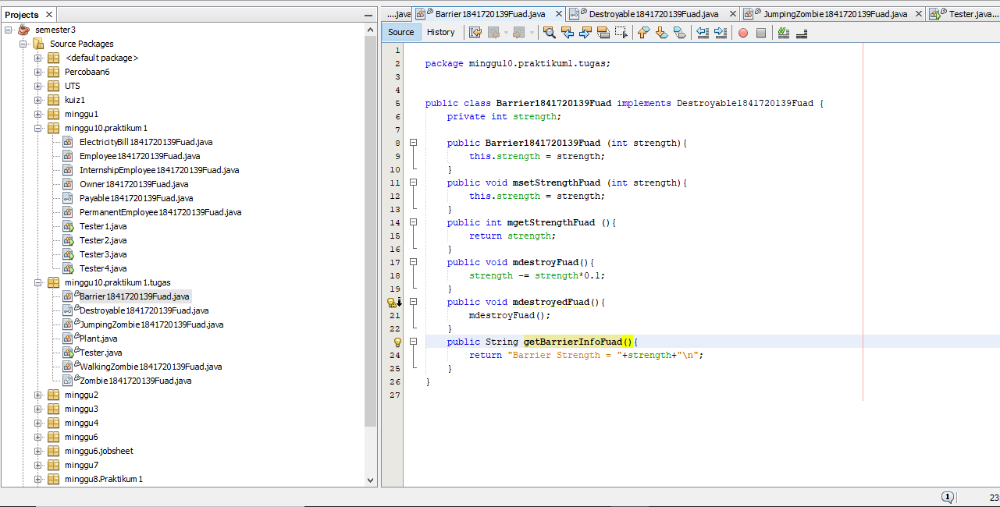

Link kode program : 
[Barrier](../../src/10_Polimorfisme/Barrier1841720139Fuad.java)

Class Plant
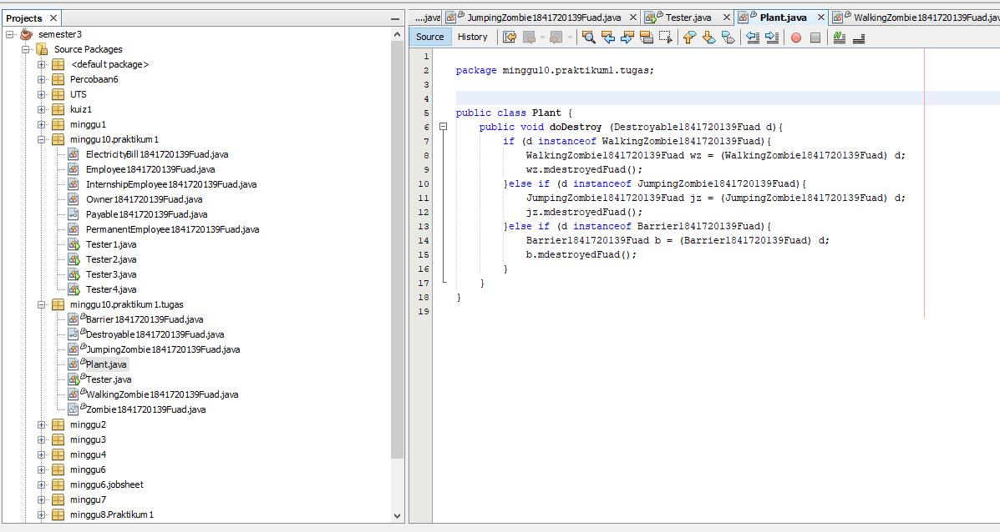

Link kode program : 
[Plant](../../src/10_Polimorfisme/Plant.java)

Class Tester
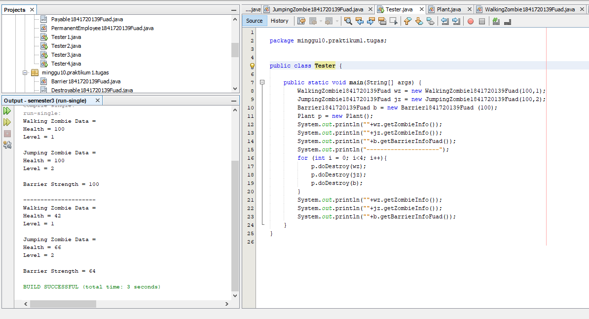

Link kode program : 
[Tester](../../src/10_Polimorfisme/Tester.java)

#### Pertanyaan

## Kesimpulan

saya masih seikit binggung pak .

## Pernyataan Diri

Saya menyatakan isi tugas, kode program, dan laporan praktikum ini dibuat oleh saya sendiri. Saya tidak melakukan plagiasi, kecurangan, menyalin/menggandakan milik orang lain.

Jika saya melakukan plagiasi, kecurangan, atau melanggar hak kekayaan intelektual, saya siap untuk mendapat sanksi atau hukuman sesuai peraturan perundang-undangan yang berlaku.

Ttd,

***(TRI FUAD)***