# Laporan Praktikum #11 - GUI

## Kompetensi
Setelah menyelesaikan lembar kerja ini mahasiswa diharapkan mampu: 

1. Membuat aplikasi Graphical User Interface sederhana dengan bahasa pemrograman java; 
2. Mengenal komponen GUI seperti frame, label, textfield, combobox, radiobutton, checkbox, textarea, menu, serta table; 
3. Menambahkan event handling pada aplikasi GUI.

## Ringkasan Materi

untuk keseluruhan dalam menyelesaikan tugas yang di berikan dosen tidak ada masalah, mulai terbiasa dengan cara pengiriman 

## Praktikum

### Percobaan 1

Class HelloGUI
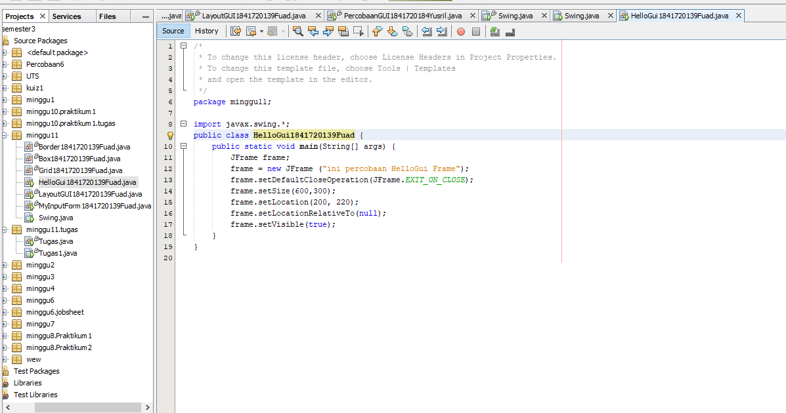
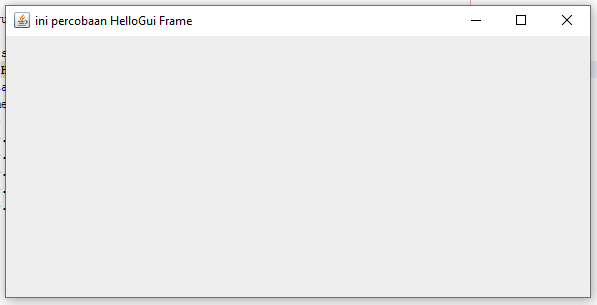

Link kode program : 
[HelloGUI](../../src/11_GUI/HelloGui1841720139Fuad.java)

### Percobaan 2
Class MyInputForm
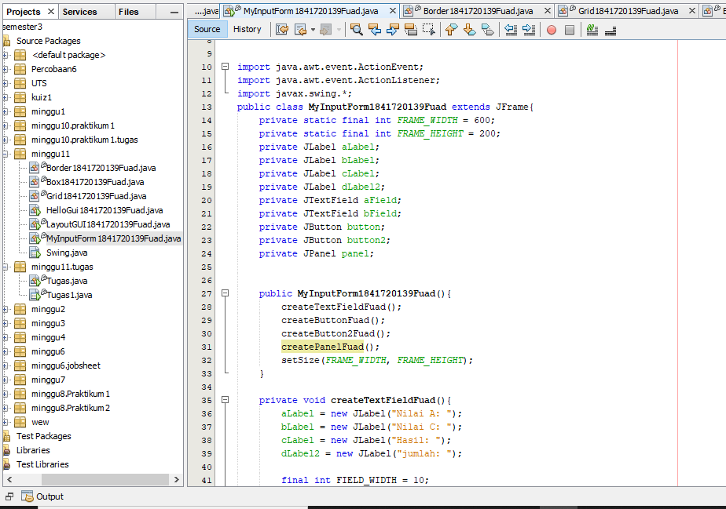
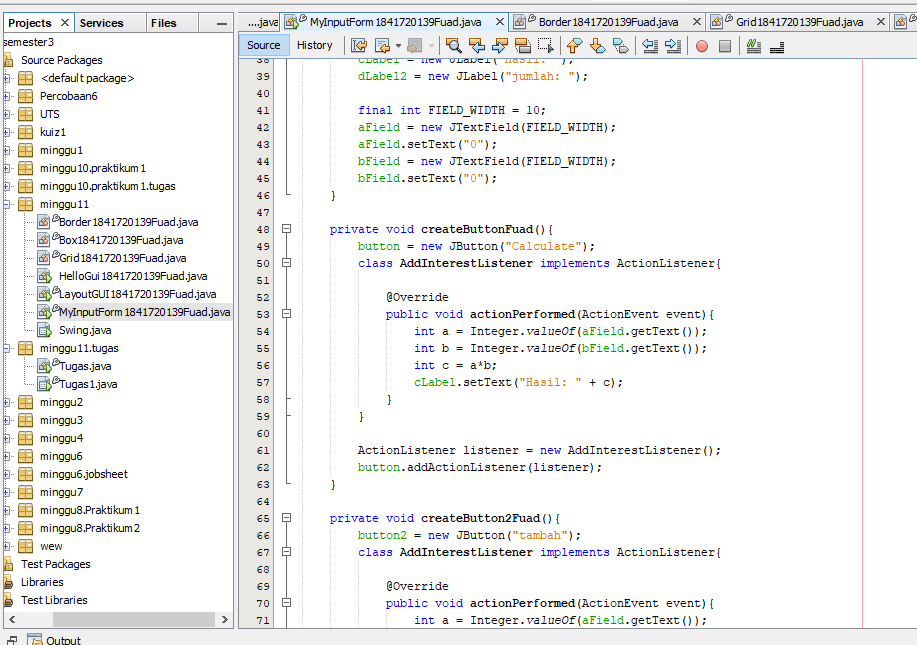
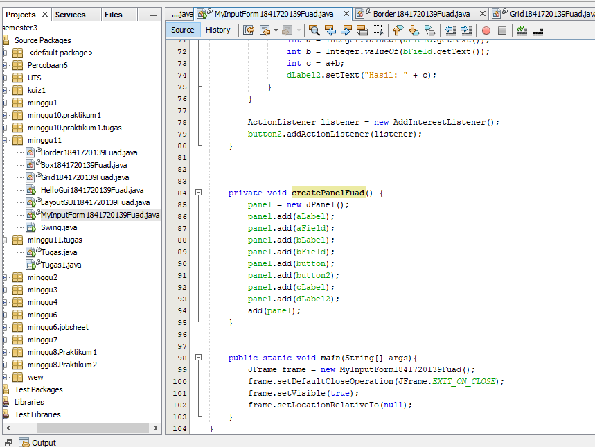

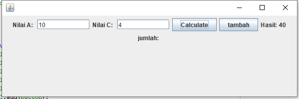

Link kode program : 
[MyInputForm](../../src/11_GUI/MyInputForm1841720139Fuad.java)

#### Pertanyaan
1. Modifikasi kode program dengan menambahkan JButton baru untuk melakukan fungsi perhitungan penambahan, sehingga ketika button di klik (event click) maka akan menampilkan hasil penambahan dari nilai A dan B

jawab :
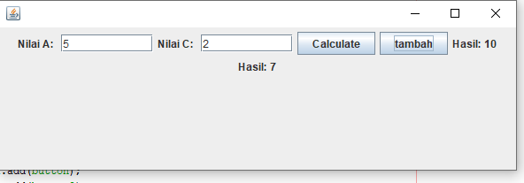

### Percobaan 3
Class Border
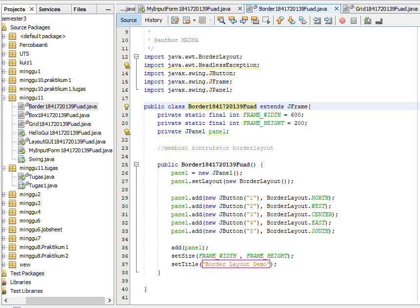

Link kode program : 
[Border](../../src/11_GUI/Border1841720139Fuad.java)

Class Grid
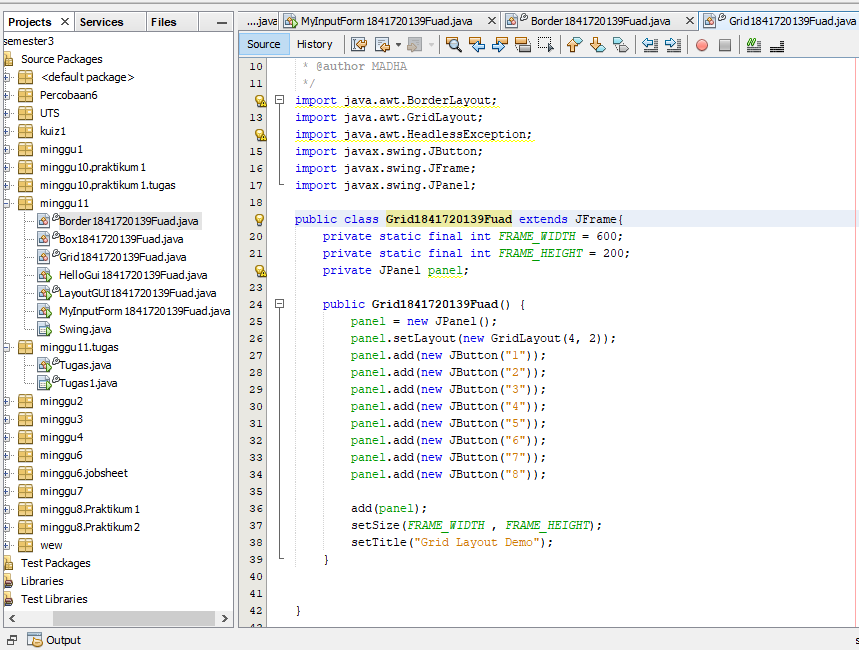

Link kode program : 
[Grid](../../src/11_GUI/Grid1841720139Fuad.java)

Class Box
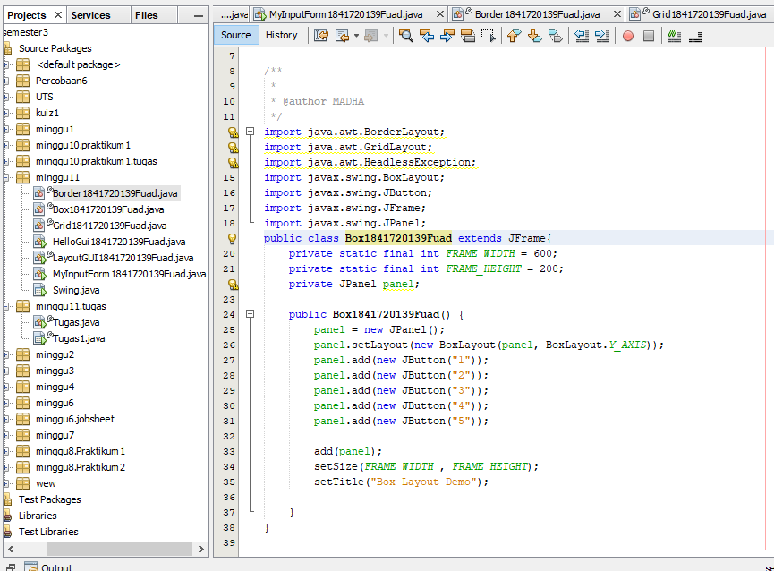

Link kode program : 
[Box](../../src/11_GUI/Box1841720139Fuad.java)

Class LayoutGUI
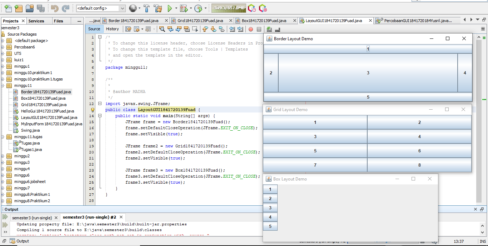

Link kode program : 
[LayoutGUI](../../src/11_GUI/LayoutGUI1841720139Fuad.java)

#### Pertanyaan
1. Apa perbedaan dari Grid Layout, Box Layout dan Border Layout? 
  jawab:
  Perbedaan dari Grid Layout, Box Layout dan Border Layout adalah BorderLayout  menyusun komponen berdasarkan lokasi geografis: NORTH, SOUTH, EAST, WEST, and CENTER. BoxLayout Cara kerjanya sangat sederhana yaitu menempatkan komponen dalam satu baris atau satu kolom. GridLayout menempatkan komponen dengan ur utan dari kiri ke kanan dan dari atas ke bawah.GridLayout akan memaksa setiap komponen untuk menempati space container yang kosong serta membagi rata ukuran space tersebut 
2.  Apakah fungsi dari masing-masing kode berikut? 
   jawab : 
   Fungsi dari masing masing kode tersebut yaitu Fungsi untuk mengeluarkan hasil frame dari kelas Border, Grid, dan Box Serta pada funsi tersebut terdapat setDefaultCloseOperation untuk pengoperasian default program akan berhenti jika ditutup dan terdapat fungsi setVisible untuk menampikan frame.

### Percobaan 4
Class Swing
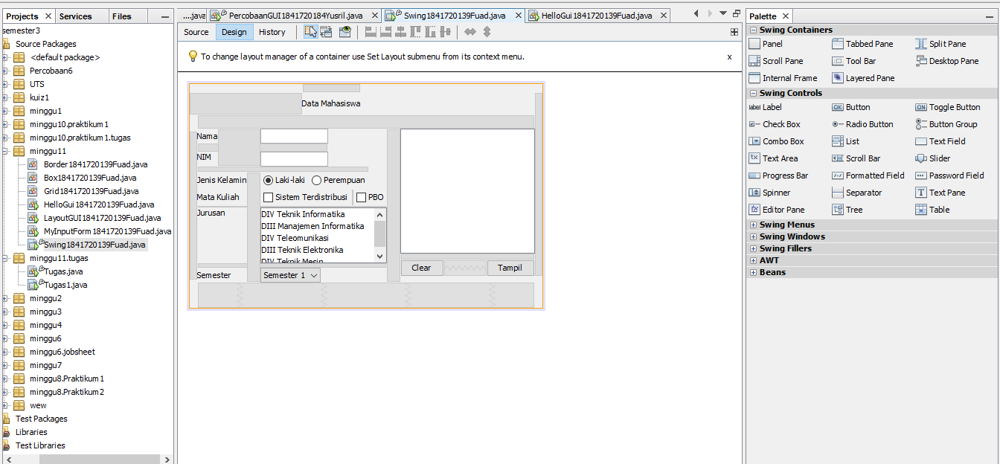
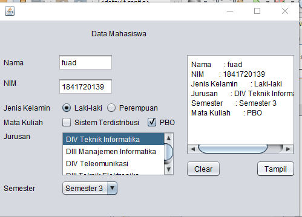
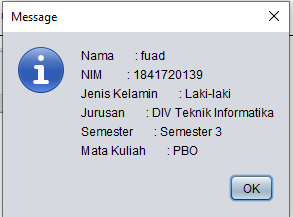

Link kode program : 
[Swing](../../src/11_GUI/Swing1841720139Fuad.java)

#### Pertanyaan
1. Apakah fungsi dari kode berikut? 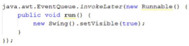
  jawab: 
  Yaitu untuk menangani event klik pada tombol serta menampilkan frame
2. Mengapa pada bagian logika checkbox dan radio button digunakan multiple if ?
   jawab: 
   Pada bagian logika checkbox dan radio button digunakan multiple if karena merupakan percabangan atau pilihan maka dari itu menggunakan multiple if 
3. Lakukan modifikasi pada program untuk melakukan menambahkan inputan berupa alamat dan berikan fungsi pemeriksaan pada nilai Alamat tersebut jika belum diisi dengan menampilkan pesan peringatan 
   jawab: 
   Memodifikasi pada program untuk melakukan menambahkan inputan berupa alamat dan berikan fungsi pemeriksaan pada nilai Alamat tersebut jika belum diisi dengan menampilkan pesan peringatan 
   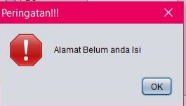
 

### Percobaan 5
Class Swing2
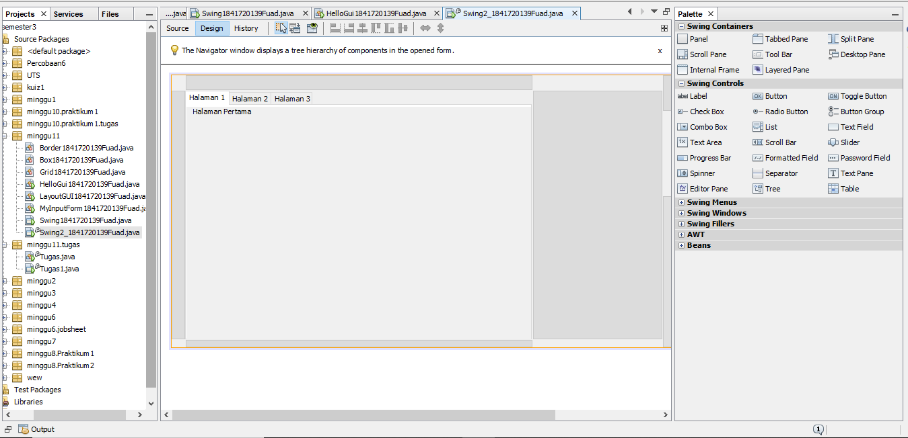
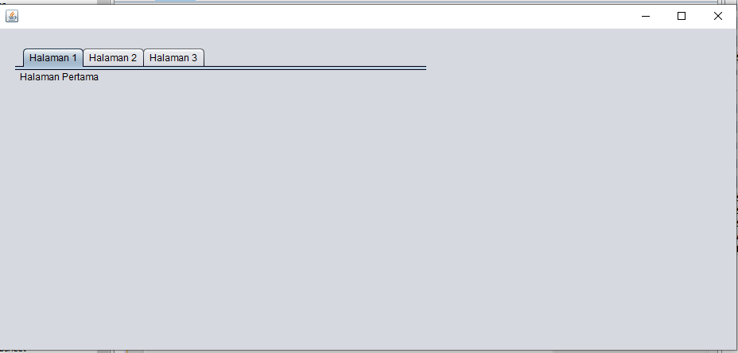
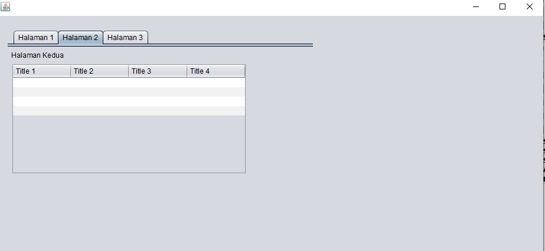
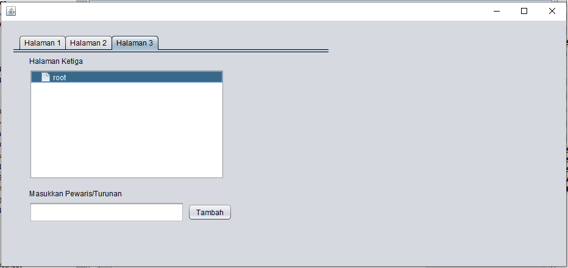

Link kode program : 
[Swing2](../../src/11_GUI/Swing2_1841720139Fuad.java)
#### Pertanyaan
1. Apa kegunaan komponen swing JTabPane, JTtree, pada percobaan 5?
   jawab: 
   Kegunaan JTtree dan JTabphone  JTree adalah jenis grafik khusus yang dirancang untuk menampilkan data dengan hirarki properti dengan menambahkan node ke node dan menyimpan konsep induk dan anak node. JTabPane panel yang berfungsi untuk beralih dari tab 1 ke tab lainnya
2. Modifikasi program untuk menambahkan komponen JTable pada tab Halaman 1 dan tab Halaman 2 
   jawab: 

### Tugas
Class Kalkulator
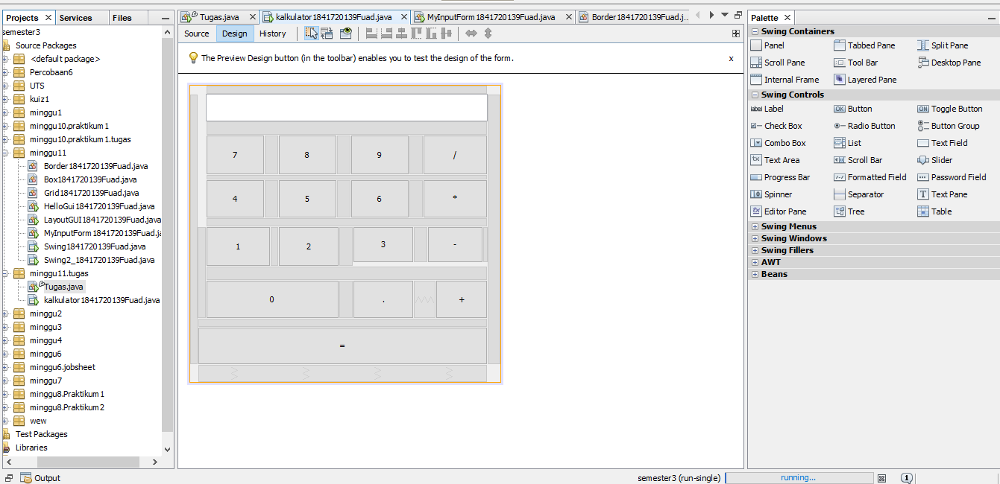
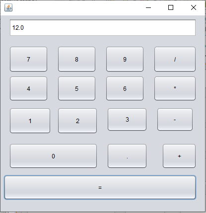

Link kode program : 
[Kalkulator](../../src/11_GUI/kalkulator1841720139Fuad.java)

#### Pertanyaan

## Kesimpulan

ada sedikit kendala pada tugas pak, saat melakukan operasi pengurangan tetapi masih hasil penjumlahan 

## Pernyataan Diri

Saya menyatakan isi tugas, kode program, dan laporan praktikum ini dibuat oleh saya sendiri. Saya tidak melakukan plagiasi, kecurangan, menyalin/menggandakan milik orang lain.

Jika saya melakukan plagiasi, kecurangan, atau melanggar hak kekayaan intelektual, saya siap untuk mendapat sanksi atau hukuman sesuai peraturan perundang-undangan yang berlaku.

Ttd,

***(TRI FUAD)***