# Laporan Praktikum #11 - Java API

## Kompetensi
Setelah menyelesaikan lembar kerja ini mahasiswa diharapkan mampu: 

* Memahami cara penyimpanan objek menggunakan Collection dan Map. 
* Mengetahui pengelompokan dari Collection. 
* Mengetahui perbedaan dari interface Set, List dan Map.  
* Mengetahui penggunaan class-class dari interface Set, List, dan Map. 
* Memahami koneksi database menggunakan JDBC dan JDBC API 

## Ringkasan Materi

untuk keseluruhan dalam menyelesaikan tugas yang di berikan dosen tidak ada masalah, mulai terbiasa dengan cara pengiriman 

## Praktikum

### Percobaan 1

Class CobaHashSet
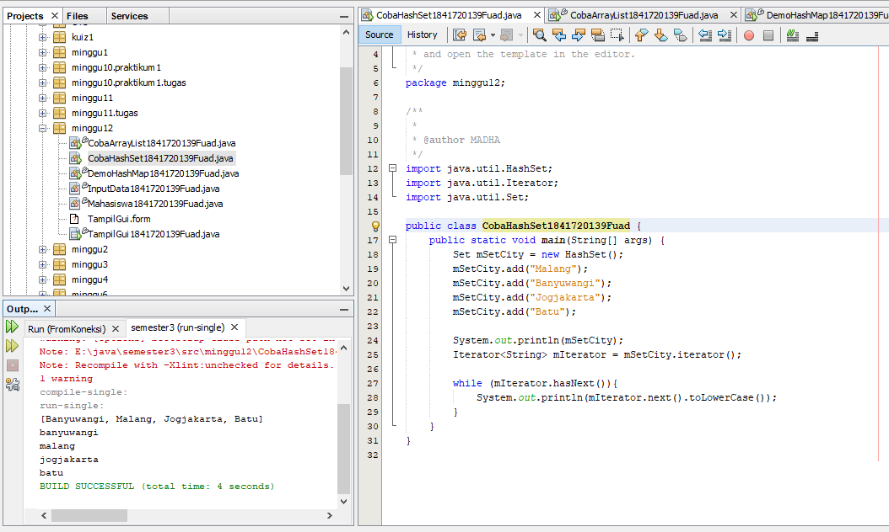

Link kode program : 
[CobaHashSet](../../src/12_Java_API/CobaHashSet1841720139Fuad.java)

#### Pertanyaan
1. Apakah fungsi import java.util.* ; pada program diatas! 
   
   jawab : fungsi import java.util.*; untuk memanggil atau memasukkan fungsi" yang ada di java.util
2. Pada baris program keberapakah yang berfungsi untuk menciptakan object HashSet? 
   
   jawab : pada baris 18
3. Apakah fungsi potongan program dibawah ini pada percobaan 1! 

    jawab : Untuk menambahkan objek kedalam HashSet() 
4. Tambahkan set.add(“Malang”); kemudian jalankan program! Amati hasilnya dan jelaskan mengapa terjadi error

    jawab : Karena nama objek yang seharusnya adalah mSetCity. Jika mengunakan set maka program tidak mengenali objek tersebut. 
5. Jelaskan fungsi potongan program dibawah ini pada percobaan 1!

    jawab : Iterator digunakan untuk mengakses dan menampilkan nilai beserta tambahan ethod lalin yang didefinisikan di dalam interface Iterator. 

### Percobaan 2
Class ArrayList
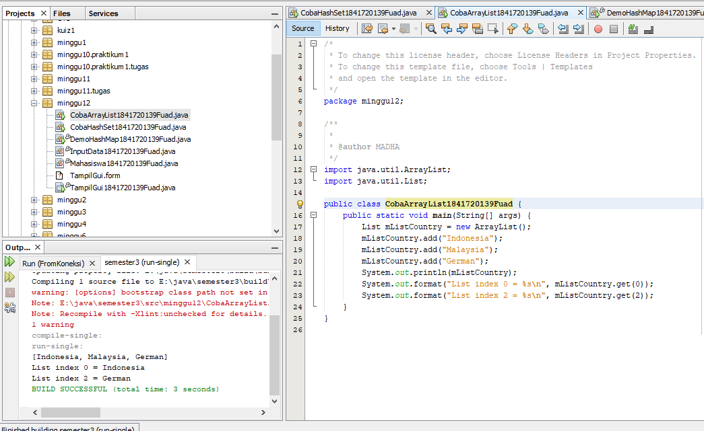

Link kode program : 
[ArrayList](../../src/12_Java_API/CobaArrayList1841720139Fuad.java)

#### Pertanyaan
1. Apakah fungsi potongan program dibawah ini! 

    jawab : Untuk menampilkan nilai dari mListCountry dan menampilkan data mListCountry index ke 0 dan index ke 2. 
2. Ganti potongan program pada soal no 1 menjadi sebagai berikut

    jawab : 
3. Jelaskan perbedaan menampilkan data pada ArrayList menggunakan potongan program pada soal no 1 dan no 2
   
   jawab : Ketika menggunakan potongan program no 1 maka menampilkan data menggunakan list, sedangkan pada potongan program no 2 menampilkan semua data dengan iterator. 

### Percobaan 3
Class CobaHashMap
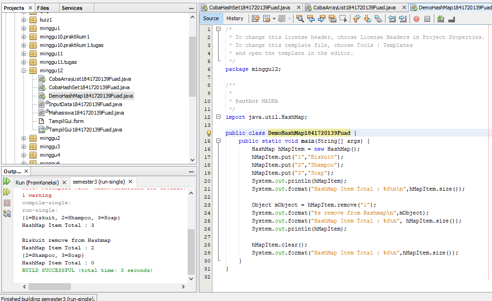

Link kode program : 
[CobaHashMap](../../src/12_Java_API/DemoHashMap1841720139Fuad.java)

#### Pertanyaan
1. Jelaskan fungsi hMapItem.put("1","Biskuit") pada program! 
   
   jawab : Untuk menambahkan object dengan key 1 dengan nama biscuit ke dalam object hMapItem pada HashMap(). 
2. Jelaskan fungsi hMapItem.size() pada program

    jawab : Untuk menampilkan size atau banyak data dari hMapItem. 
3. Jelaskan fungsi hMapItem.remove("1") pada program! 
   
   jawab : Untuk menghapus item dengan key 1. 
4. Jelaskan fungsi hMapItem.clear() pada program!
   
   jawab : Untuk menghapus semua data yang ada pada hMapItem
5. Tambahkan kode program yang di blok pada program yang sudah anda buat!
   
   jawab : 
6. Jalankan program dan amati apa yang terjadi! 
   
   jawab : 
7. Apakah perbedaan program sebelumnya dan setelah ditambahkan kode program pada soal no 5 diatas? Jelaskan! 
   
   jawab : Setelah ditambahkan kode program tersebut adalah adanya penampilan data menggunakan iterator. 

### Percobaan 4
Class Mahasiswa
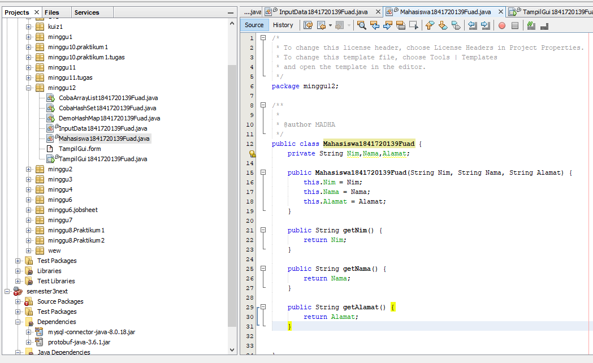
Link kode program : 
[Mahasiswa](../../src/12_Java_API/Mahasiswa1841720139Fuad.java)

Class InputData
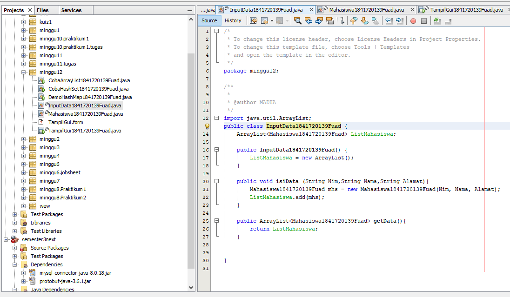
Link kode program : 
[InputData](../../src/12_Java_API/InputData1841720139Fuad.java)

CLass TampilGui
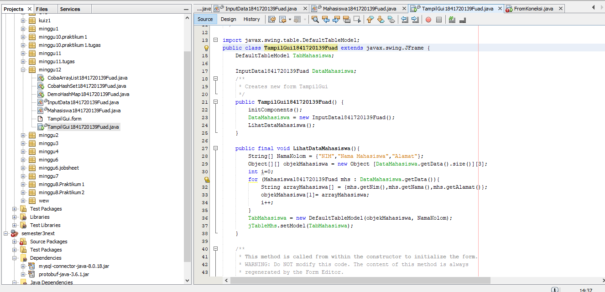
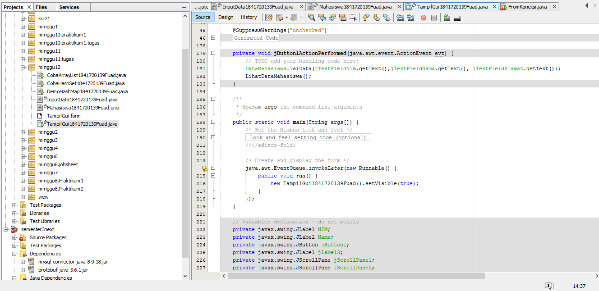
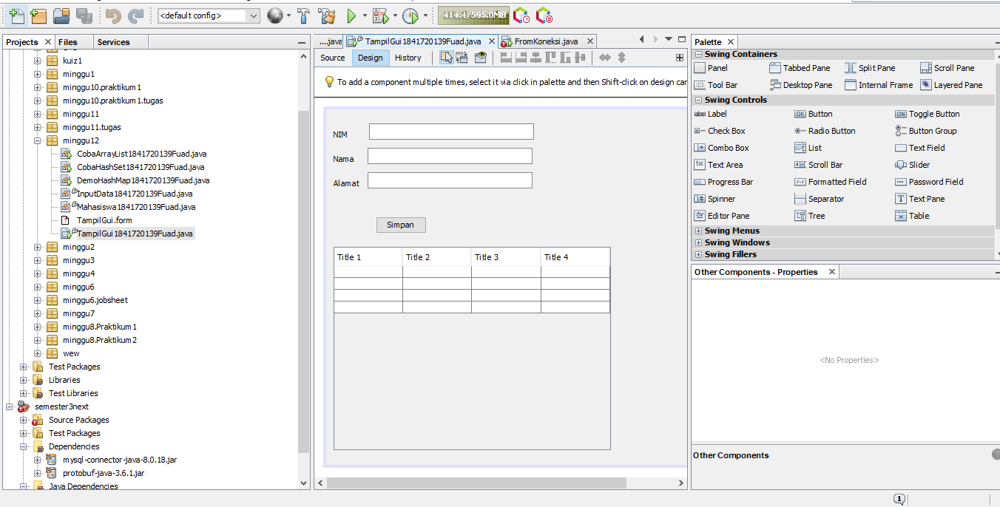
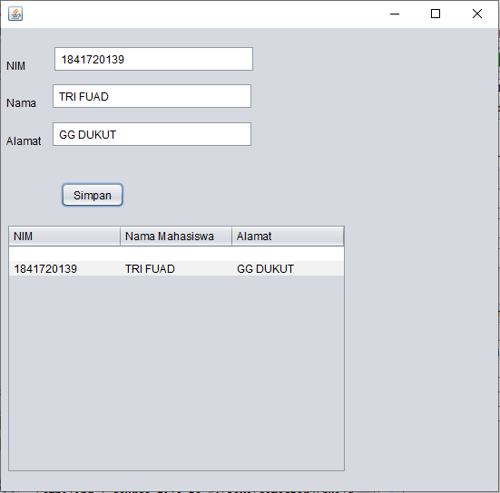

Link kode program : 
[TampilGui](../../src/12_Java_API/TampilGui1841720139Fuad.java)

### Percobaan 5
Class FromKoneksi

(source)
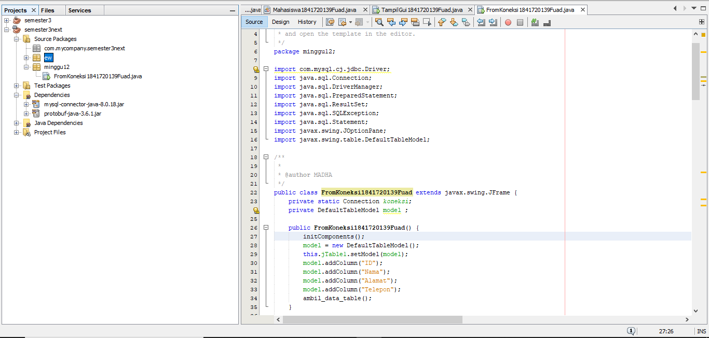
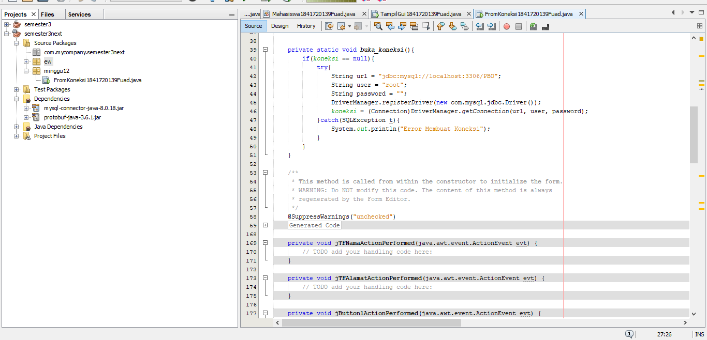
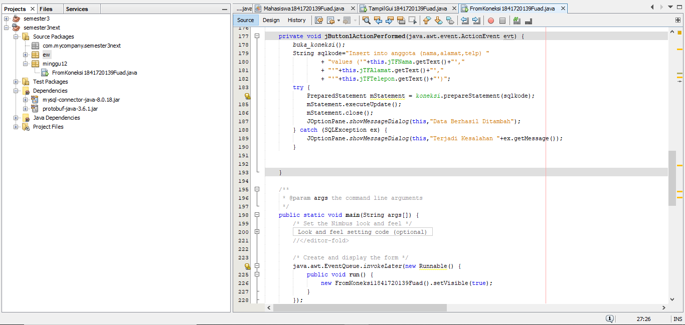
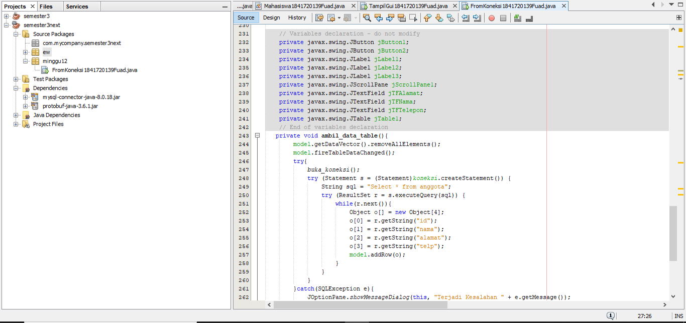
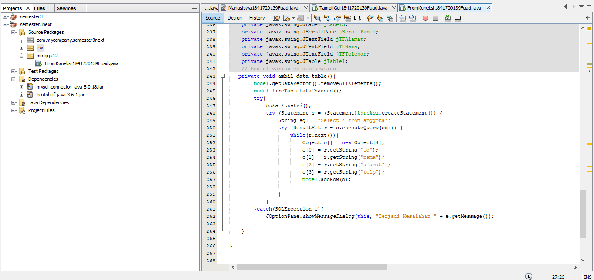

(Desing)
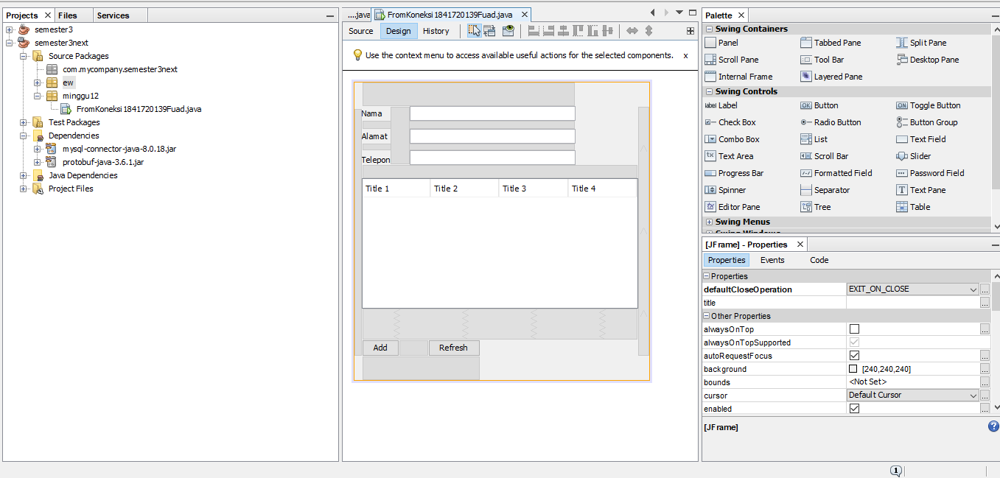

(Running Program)
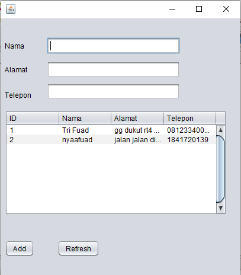
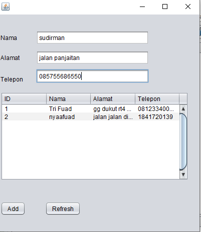
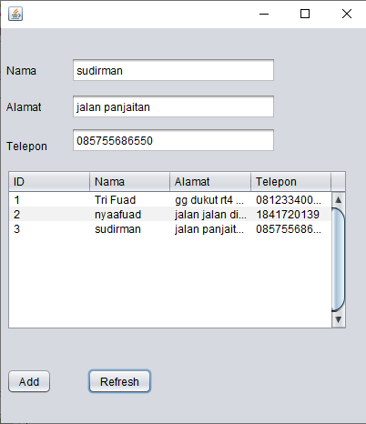

Link kode program : 
[FromKoneksi](../../src/12_Java_API/FromKoneksi1841720139Fuad.java)
#### Pertanyaan
5. Setelah menambah code pada action button klik, coba jalankan program dan tambahkan data. Apakah program berhasil menambahkan data? Jika tidak apakah penyebabnya. 

    jawab : tidak ,karena masi ada eror yang terjadi kare harus menambah beberapa import sepersi statement salah satunya.
6. Jelaskan maksud source code untuk melakukan insert data diatas? 
   
   jawab : source code menanbahkan data atau add data ke data base yang sudah kita buat
7. Jelaskan alur dari method ambil_data_tabel? 
   
   jawab: yang pertama data di kita isikan lalu setalah klic tombol add maka database akan di tambah kan kedalam database untuk mengeluarkan tinggal kita klik button refresh
10.  Buat fungsi untuk merefresh sehingga data yang baru dapat ditampilkan pada tabel. 2.
    
    jawab : 
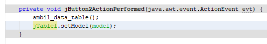
 

## Kesimpulan

ada sedikit kendala pada tugas pak, saat melakukan operasi pengurangan tetapi masih hasil penjumlahan 

## Pernyataan Diri

Saya menyatakan isi tugas, kode program, dan laporan praktikum ini dibuat oleh saya sendiri. Saya tidak melakukan plagiasi, kecurangan, menyalin/menggandakan milik orang lain.

Jika saya melakukan plagiasi, kecurangan, atau melanggar hak kekayaan intelektual, saya siap untuk mendapat sanksi atau hukuman sesuai peraturan perundang-undangan yang berlaku.

Ttd,

***(TRI FUAD)***