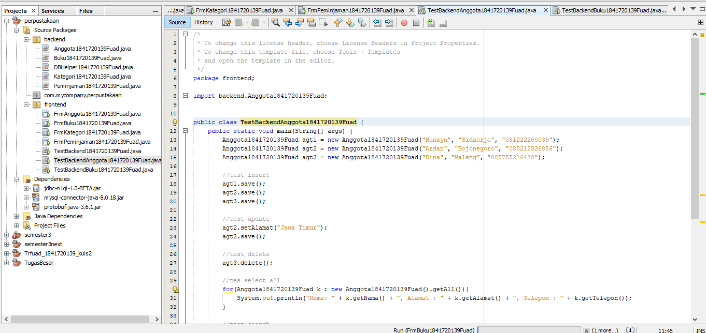
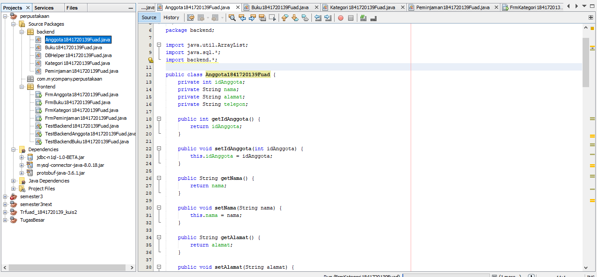

# Laporan Praktikum #14 - GUI dan Database 

## Kompetensi

Setelah menempuh materi percobaan ini, mahasiswa mampu mengenal: 
1. Menggunakan paradigma berorientasi objek untuk interaksi dengan database 
2. Membuat backend dan frontend 
3. Membuat form sebagai fronten

## Ringkasan Materix
Kali ini kita akan menggunakan paradigma berorientasi objek yang telah kita pelajari untuk membuat aplikasi berbasis database dan dilengkapi dengan form sebagai Graphical User Interface (GUI). 

Secara umum, tahapan yang akan kita lakukan adalah sebagai berikut: 

1. Membuat database dan tabel-tabelnya. 
2. Membuat backend yang berisi class-class yang mewakili data yang ada pada database, dan class helper untuk melakukan eksekusi query database. 
3. Membuat frontend yang merupakan antarmuka kepada pengguna. Frontend ini bisa berbasis teks (console), GUI, web, mobile, dan sebagainya. 

## Percobaan

### Percobaan 1 

Langkah pertama untuk percobaan ini adalah membuat database. Install XAMPP, buka phpMyAdmin, buat database dbperpus, dan tabel-tabelnya:  

### Percobaan 2 

Mempersiapkan project. 

1. Buat project baru, beri nama Perpustakaan. 
2. Pada project explorer, klik kanan pada Libraries → Add Library, pilih MySQL JDBC Driver. 
3. Buat package frontend dan backend. Cara membuat package adalah, pada project explorer, klik kanan pada Source Packages → New → Java Package, beri nama package nya (frontend, backend). 
   
   

### Percobaan 3 

DBHelper : [Click](../../src/14_GUI_dan_Database/backend/DBHelper1841720139Fuad.java)

### Percobaan 4

Kategori : [Click](../../src/14_GUI_dan_Database/backend/Kategori1841720139Fuad.java)

### Percobaan 5 

TestBackend : [Click](../../src/14_GUI_dan_Database/frontend/TestBackend1841720139Fuad.java)

### Percobaan 6 

FrmKategori : [Click](../../src/14_GUI_dan_Database/frontend/FrmKategori1841720139Fuad.java)

### Percobaan 6 (2)

Test Backend Anggota : [Click](../../src/14_GUI_dan_Database/frontend/TestBackendAnggota1841720139Fuad.java)

Anggota : [Click](../../src/14_GUI_dan_Database/backend/Anggota1841720139Fuad.java)

### Percobaan 7

FrmAnggota : [Click](../../src/14_GUI_dan_Database/frontend/FrmAnggota1841720139Fuad.java)

### Percobaan 7 (2)

Buku : [Click](../../src/14_GUI_dan_Database/backend/Buku1841720139Fuad.java)

### Percobaan 8 

FrmBuku : [Click](../../src/14_GUI_dan_Database/frontend/FrmBuku1841720139Fuad.java)

### TUGAS

FrmBuku : [Click](../../src/14_GUI_dan_Database/frontend//FrmPeminjaman1841720139Fuad.java)

## Kesimpulan

Setelah menempuh materi percobaan ini, mahasiswa mampu mengenal paradigma berorientasi objek untuk interaksi dengan database , Membuat backend dan frontend , Membuat form sebagai fronten

## Pernyataan Diri

Saya menyatakan isi tugas, kode program, dan laporan praktikum ini dibuat oleh saya sendiri. Saya tidak melakukan plagiasi, kecurangan, menyalin/menggandakan milik orang lain.

Jika saya melakukan plagiasi, kecurangan, atau melanggar hak kekayaan intelektual, saya siap untuk mendapat sanksi atau hukuman sesuai peraturan perundang-undangan yang berlaku.

Ttd,

***Tri Fuad***
