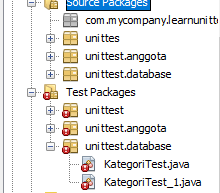

# Laporan Praktikum #15 – Unit Testing  

## Kompetensi

Setelah menyelesaikan lembar kerja ini mahasiswa diharapkan mampu: 
1. Memahami konsep dan fungsi unit testing 
2. Menerapkan unit testing dengan JUnit pada program sederhana. 
3. Menerapkan unit testing dengan JUnit pada progam yang terkoneksi database

## Ringkasan Materix
Pada percobaan yang pertama ini kita akan membuat sebuah program sederhana yang mengilustrasikan sebuah aplikasi pengiriman pesan. Pada program tersebut terdapat satu class utama dimana didalamnya terdapat beberapa method sederhana yang nantinya akan dibuatkan unit test-nya.

## Percobaan

### Percobaan 1 
 

Message Processor : [KLIK](../../src/15_Unit_Testing/MessageProcessor.java)

LearnUnitTesting : [KLIK](../../src/15_Unit_Testing/LearnUnitTesting.java)

## ----------------

Message Processor Test : [KLIK](../../src/15_Unit_Testing/MessageProcessorTest.java)

TestRunner : [KLIK](../../src/15_Unit_Testing/TestRunner.java)

### Percobaan 2 

DBHelper : [KLIK](../../src/15_Unit_Testing/DBHelper.java)

FormKategori : [KLIK](../../src/15_Unit_Testing/FormKategori.java)

Kategori : [KLIK](../../src/15_Unit_Testing/Kategori.java)

TestBackend : [KLIK](../../src/15_Unit_Testing/TestBackend.java)

KategoriTest : [KLIK](../../src/15_Unit_Testing/KategoriTest.java)

TestBackend : [KLIK](../../src/15_Unit_Testing/TestBackend.java)

TestRunner : [KLIK](../../src/15_Unit_Testing/TestRunner.java)

### TUGAS

FormKategori : [KLIK](../../src/15_Unit_Testing/Tugas/FormKategori.java)

Kategori : [KLIK](../../src/15_Unit_Testing/Tugas/Kategori.java)

DBHelper : [KLIK](../../src/15_Unit_Testing/Tugas/DBHelper.java)

## Kesimpulan

Setelah menempuh materi percobaan ini, mahasiswa mampu mengenal paradigma berorientasi objek untuk interaksi dengan database , Membuat backend dan frontend , Membuat form sebagai fronten

## Pernyataan Diri

Saya menyatakan isi tugas, kode program, dan laporan praktikum ini dibuat oleh saya sendiri. Saya tidak melakukan plagiasi, kecurangan, menyalin/menggandakan milik orang lain.

Jika saya melakukan plagiasi, kecurangan, atau melanggar hak kekayaan intelektual, saya siap untuk mendapat sanksi atau hukuman sesuai peraturan perundang-undangan yang berlaku.

Ttd,

***Tri Fuad***
