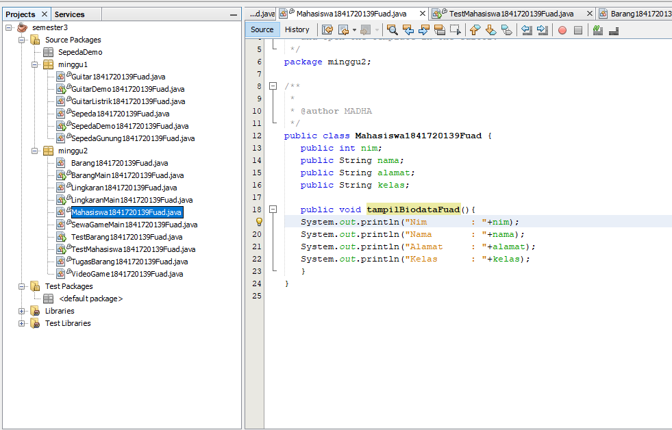

# Laporan Praktikum #2 - Class dan Object

## Kompetensi

 Mahasiswa dapat memahami deskripsi dari class dan object 

 Mahasiswa memahami implementasi dari class 

 Mahasiswa dapat memahami implementasi dari attribute 

 Mahasiswa dapat memahami implementasi dari method 

 Mahasiswa dapat memahami implementasi dari proses instansiasi 

 Mahasiswa dapat memahami implementasi dari try-catch 

 Mahasiswa dapat memahami proses pemodelan class diagram menggunakan UML 

## Ringkasan Materi

(berisi catatan penting pribadi selama praktikum berlangsung ataupun menemukan permasalahan khusus saat melakukan percobaan)

## Percobaan

### Percobaan 1

(berisi penjelasan percobaan 1. Jika ada rujukan ke file program, bisa dibuat linknya di sini.)

`contoh screenshot yang benar, menampilkan 3 komponen, yaitu struktur project, kode program, dan hasil kompilasi`

### Percobaan 2

(berisi penjelasan percobaan 2. Jika ada rujukan ke file program, bisa dibuat linknya di sini.)

`contoh screenshot yang benar, menampilkan 3 komponen, yaitu struktur project, kode program, dan hasil kompilasi`

Contoh link kode program : [kode program Mahasiswa1841720139Fuad ](../../src/2_Class_dan_Object/Mahasiswa1841720139Fuad.java)

Contoh link kode program : [kode program testMahasiswa1841720139Fuad ](../../src/2_Class_dan_Object/testMahasiswa1841720139Fuad.java)

### Percobaan 3

(berisi penjelasan percobaan 3. Jika ada rujukan ke file program, bisa dibuat linknya di sini.)

`contoh screenshot yang benar, menampilkan 3 komponen, yaitu struktur project, kode program, dan hasil kompilasi`

Contoh link kode program : [kode program Barang1841720139Fuad ](../../src/2_Class_dan_Object/Barang1841720139Fuad.java)

Contoh link kode program : [kode program testBarang1841720139Fuad ](../../src/2_Class_dan_Object/testBarang1841720139Fuad.java)

## Tugas

(silakan kerjakan tugas di sini beserta `screenshot` hasil kompilasi program. Jika ada rujukan ke file program, bisa dibuat linknya di sini.)

`contoh screenshot yang benar, menampilkan 3 komponen, yaitu struktur project, kode program, dan hasil kompilasi`

(1.Video Game)

Contoh link kode program : [kode program VideoGame1841720139Fuad ](../../src/2_Class_dan_Object/VideoGame1841720139Fuad.java)

Contoh link kode program : [kode program SewaGameMain1841720139Fuad ](../../src/2_Class_dan_Object/SewaGameMain1841720139Fuad.java)

(2.Lingkaran)

Contoh link kode program : [kode program Lingkaran1841720139Fuad ](../../src/2_Class_dan_Object/Lingkaran1841720139Fuad.java)

Contoh link kode program : [kode program LingkaranMain1841720139Fuad ](../../src/2_Class_dan_Object/LingkaranMain1841720139Fuad.java)

(3. Barang)

Contoh link kode program : [kode program TugasBarang1841720139Fuad ](../../src/2_Class_dan_Object/TugasBarang1841720139Fuad.java)

Contoh link kode program : [kode program BarangMain1841720139Fuad ](../../src/2_Class_dan_Object/BarangMain1841720139Fuad.java)

## Kesimpulan

(yang saya dapat dari praktikum jobsheet1 adalah saya memanggil dan menambahkan program baru pada satu main)

## Pernyataan Diri

Saya menyatakan isi tugas, kode program, dan laporan praktikum ini dibuat oleh saya sendiri. Saya tidak melakukan plagiasi, kecurangan, menyalin/menggandakan milik orang lain.

Jika saya melakukan plagiasi, kecurangan, atau melanggar hak kekayaan intelektual, saya siap untuk mendapat sanksi atau hukuman sesuai peraturan perundang-undangan yang berlaku.

Ttd,

***(TRI FUAD)***