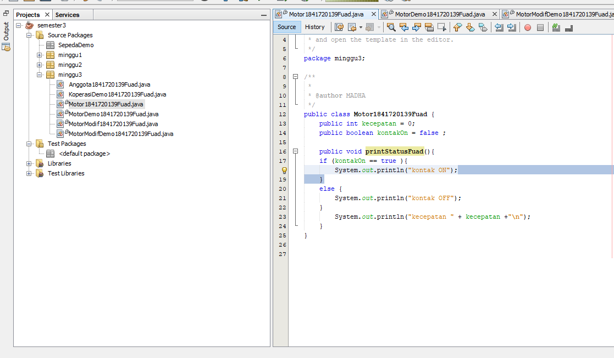

# Laporan Praktikum #3 - Enkapsulasi Pada Pemrograman Berorientasi Objek 

TRI FUAD
## Kompetensi

1. Konstruktor
2. Akses Modifier
3. Atribut/method pada class
4. Intansiasi atribut/method 
5. Setter dan getter
6. Memahami notasi pada UML Class Diagram 

## Ringkasan Materi

untuk keseluruhan dalam menyelesaikan tugas yang di berikan dosen tidak ada masalah, mulai terbiasa dengan cara pengiriman 

## Percobaan

### Percobaan 1

 (Enkapsulasi)

Contoh link kode program : 
[Motor1841720139Fuad](../../src/3_Enkapsulasi/Motor1841720139Fuad.java)

Contoh link kode program : 
[MotorDemo1841720139Fuad](../../src/3_Enkapsulasi/MotorDemo1841720139Fuad.java)

### Percobaan 2

( Access Modifier )

Contoh link kode program : [MotorModif1841720139Fuad](../../src/3_Enkapsulasi/MotorModif1841720139Fuad.java)

Contoh link kode program : [MotorModifDemo1841720139Fuad](../../src/3_Enkapsulasi/MotorModifDemo1841720139Fuad.java)

### Pertanyaan
Soal

1. Pada class TestMobil, saat kita menambah kecepatan untuk pertama kalinya, mengapa
muncul peringatan “Kecepatan tidak bisa bertambah karena Mesin Off!”?  
2. Mengapat atribut kecepatan dan kontakOn diset private?  
3. Ubah class Motor sehingga kecepatan maksimalnya adalah 100!

Jawab
1. Karena method tambahKecepatan dipanggil sebelum method nyalakanMesin yang digunakan untuk menyalakan mesin dipanggil
2. Agar atribut kecepatan dan kontak0n tidak bisa diakses oleh class lain
3. 

### Percobaan 3

( Getter dan Setter )

Contoh link kode program :
[Anggota1841720139Fuad](../../src/3_Enkapsulasi/Anggota1841720139Fuad.java)

Contoh link kode program : [KoperasiDemo1841720139Fuad](../../src/3_Enkapsulasi/KoperasiDemo1841720139Fuad.java)

### Percobaan 4
( Konstruktor, Instansiasi )

Contoh link kode program :
[Anggota1841720139Fuad](../../src/3_Enkapsulasi/Anggota1841720139Fuad.java)
Contoh link kode program : [KoperasiDemo1841720139Fuad](../../src/3_Enkapsulasi/KoperasiDemo1841720139Fuad.java)

### Pertanyaan
    Soal
1. Apa yang dimaksud getter dan setter?
2. Apa kegunaan dari method getSimpanan()?
3. Method apa yang digunakan untk menambah saldo?
4. Apa yand dimaksud konstruktor?
5. Sebutkan aturan dalam membuat konstruktor?
6. Apakah boleh konstruktor bertipe private?
7. Kapan menggunakan parameter dengan passsing parameter?
8. Apa perbedaan atribut class dan instansiasi atribut?
9. Apa perbedaan class method dan instansiasi method?
    
### Jawab

1. data bersifat private yang tidak bisa diakses dari luar dan dua method ini bersifat mengambil dan mengisi data dalam objek
2. untuk menampilkan simpanan melalui getSimpanan()
3. public void setor1841720070yayak(float uang)
4. method khusus yang akan di jalankan secara otomatis pada objek
5.  biasanya untuk membuat proses awal dalam mempersiapkan objek, seperti memberi nilai awal kepada property method internal dan beberapa proses lain yang digunakan untuk ‘mempersiapkan’ objek.
6. Tidak,karena konstruktor bukan untuk private selalu di panggil
7. 7.	Saat akan mementukan/memberikan suatu nilai atau merubah suatu nilai pada method/fungsi pada saat di jalankan
8. Kalau menurut saya atribut class adalah atribut yang belum di beri nilai sedangkan istansiasi atribut adalah pemberian nilai pada atribut
9. Class method adalah method yang belum di berikan nilai sedangkan instansiasi method adalah penmanggilan dan pengisian nilai pada method

## Tugas
 

1. 

Contoh link kode program : 
[EncapDemo1841720139Fuad](../../src/3_Enkapsulasi/EncapDemo1841720139Fuad.java)

Contoh link kode program : 
[EncapTest1841720139Fuad](../../src/3_Enkapsulasi/EncapTest1841720139Fuad.java)

2.  Karena pada method setAge terdapat percabangan yang didalamnya berisi bila nilai dari atribut age lebih dari 30 maka nilai age akan menjadi 30 

3. 

Contoh link kode program : 
[EncapDemoUbah1841720139Fuad](../../src/3_Enkapsulasi/EncapDemoubah1841720139Fuad.java)

Contoh link kode program : 
[EncapTestUbah1841720139Fuad](../../src/3_Enkapsulasi/EncapTestubah1841720139Fuad.java)

4. 
 

 Contoh link kode program : 
[AnggotaTugas1841720139Fuad](../../src/3_Enkapsulasi/AnggotaTugas1841720139Fuad.java)

 

Contoh link kode program : 
[KopersaiTugas1841720139Fuad](../../src/3_Enkapsulasi/KoperasiTugas1841720139Fuad.java)

pak mohonmaaf link ini gak bisa dibuka karena saya pencet delete permanent pak padahal sudah saya sendiri-sendirikan pak :( 

5. 
 

 Contoh link kode program : 
[AnggotaTugasUbah1841720139Fuad](../../src/3_Enkapsulasi/AnggotaTugasUbah1841720139Fuad.java)

 

Contoh link kode program : 
[KopersaiTugasUbah1841720139Fuad](../../src/3_Enkapsulasi/KoperasiTugasUbah1841720139Fuad.java)

 pak mohonmaaf link ini gak bisa dibuka karena saya pencet delete permanent pak padahal sudah saya sendiri-sendirikan pak :( 
 

6. 
 
 Contoh link kode program : 
[AnggotaTugasUbah1841720139Fuad](../../src/3_Enkapsulasi/AnggotaTugasUbah1841720139Fuad.java)

   
   
   
[KoperasiTugasFinal1841720139Fuad](../../src/3_Enkapsulasi/KoperasiTugasFinal1841720139Fuad.java)

## Kesimpulan

•	Dari percobaan diatas, telah dipelajari kosep dari enkapsulasi, kontruktor, access modifier yang
terdiri dari 4 jenis yaitu public, protected, default dan private. Konsep atribut atau method class
yang ada di dalam blok code class dan konsep instansiasi atribut atau method. Cara penggunaan
getter dan setter beserta fungsi dari getter dan setter. Dan juga telah dipelajari atau memahami
notasi UML

## Pernyataan Diri

Saya menyatakan isi tugas, kode program, dan laporan praktikum ini dibuat oleh saya sendiri. Saya tidak melakukan plagiasi, kecurangan, menyalin/menggandakan milik orang lain.

Jika saya melakukan plagiasi, kecurangan, atau melanggar hak kekayaan intelektual, saya siap untuk mendapat sanksi atau hukuman sesuai peraturan perundang-undangan yang berlaku.

Ttd,

***(TRI FUAD)***