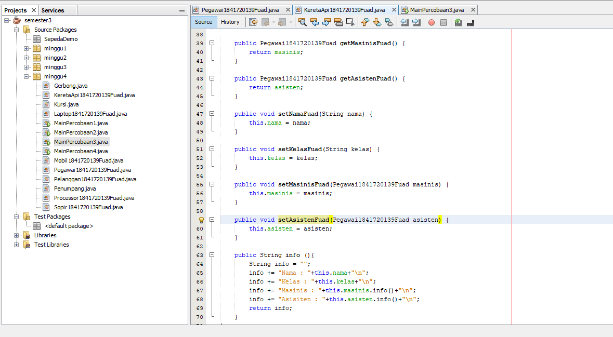

# Laporan Praktikum #4 - Realasi Kelas

TRI FUAD
## Kompetensi

Setelah menempuh pokok bahasan ini, mahasiswa mampu: 
1. Memahami konsep relasi kelas
2. Mengimplementasikan relasi has‑a dalam program. 

## Ringkasan Materi

untuk keseluruhan dalam menyelesaikan tugas yang di berikan dosen tidak ada masalah, mulai terbiasa dengan cara pengiriman 

## Percobaan

### Percobaan 1

 Class Processor

Link kode program : 
[Processor](../../src/4_Relasi_Class/Processor1841720139Fuad.java)

Class laptop

Link kode program : 
[Laptop](../../src/4_Relasi_Class/Laptop1841720139Fuad.java)

Class MainPercobaan1

Link kode program : 
[MainPercobaan1](../../src/4_Relasi_Class/MainPercobaan1.java)

### Pertanyaan
1. Di dalam class Processor dan class Laptop , terdapat method setter dan getter untuk masing‑masing atributnya. Apakah gunanya method setter dan getter tersebut ? 
  
   Jawab : fungsinya sesuai dengan namanya yaitu untu menge-set (memberi nilai) dan menge-get (mendapatkan/melihat nilai) pada suatu variabel atau class dengan contructor default
2. Di dalam class Processor dan class Laptop, masing‑masing terdapat konstruktor default dan konstruktor berparameter. Bagaimanakah beda penggunaan dari kedua jenis konstruktor tersebut ? 
   
   Jawab : bila konstruktor default, untuk memberi nilai menggunakan setter, tetapi jika kita menggunakan konstruktor berparameter, kita hanya perlu memberi nilai di parameter pada objek di class main.
3. Perhatikan class Laptop, di antara 2 atribut yang dimiliki (merk dan proc), atribut manakah yang bertipe object ? 
   
   Jawab : proc, karena inisiasi tipe variabel ditandai dengan nama object.
4. Perhatikan class Laptop, pada baris manakah yang menunjukan bahwa class Laptop memiliki relasi dengan class Processor ? 
   
   Jawab :  Terlihat jelas pada constructor, terdapat parameter yang menggunakan object Processor yang telah diinisiasi sebelumnya.
5. Perhatikan pada class Laptop , Apakah guna dari sintaks proc.info() ? 
   
   Jawab : proc.Info(), merupakan syntax yang digunakan untuk menjalankan method Info() pada class Processor.
6. Pada class MainPercobaan1, terdapat baris kode: Laptop l = new Laptop("Thinkpad", p);. Apakah p tersebut ? Dan apakah yang terjadi jika baris kode tersebut diubah menjadi: 
Laptop l = new Laptop("Thinkpad", new Processor("Intel i5", 3)); Bagaimanakah hasil program saat dijalankan, apakah ada perubahan ?

    Jawab : p merupakan object dari class Processor yang tadi telah diinstansiasi, Lalu kode program yang baru hasilnya sama saja, kode program tersebut memiliki perbedaan pada instansiasi dalam bentuk variabel object, bila pada kode program tersebut object tidak perlu diinstansiasi kedalam variabel lain tetapi ter nested atau bisa dibilang melakukan instansiasi objek dialam instansiasi object.

### Percobaan 2

Class Sopir

Link kode program : 
[Sopir](../../src/4_Relasi_Class/Sopir1841720139Fuad.java)

Class Mobil

Link kode program : 
[Mobil](../../src/4_Relasi_Class/Mobil1841720139Fuad.java)

Class Pelanggan

Link kode program : 
[Pelanggan](../../src/4_Relasi_Class/Pelangan1841720139Fuad.java)

Class MainPercobaan2

Link kode program : 
[mainpercobaan2](../../src/4_Relasi_Class/MainPercobaan21841720139Fuad.java)

### Pertanyaan
1. Perhatikan class Pelanggan. Pada baris program manakah yang menunjukan bahwa class Pelanggan memiliki relasi dengan class Mobil dan class Sopir ?

   Jawab :  Dapat dilihat pada inisiasi  variabel object di class pelanggan 
2. Perhatikan method hitungBiayaSopir pada class Sopir, serta method hitungBiayaMobil pada class Mobil. Mengapa menurut Anda method tersebut harus memiliki argument hari ? 
   
   Jawab : argumen tersebut nantinya digunakan untuk diisi dengan variabel int hari pada class Pelanggan 
3. Perhatikan kode dari class Pelanggan. Untuk apakah perintah mobil.hitungBiayaMobil(hari) dan sopir.hitungBiayaSopir(hari) ? 
   
   Jawab : kode program tersebut digunakan untuk menjumlahkan biaya mobil yang diambil dari harga sopir dikali dengan hari lalu yang dijumlahkan dengan biaya sopir yang diambil dari harga sopir dikali hari.
4. Perhatikan class MainPercobaan2. Untuk apakah sintaks p.setMobil(m) dan p.setSopir(s) ? 
   
   Jawab : kode program tersebut digunakan untuk memberi atau mengisi nilai dari namaMobil dan namaSopir yang ada pada objek pelanggan
5. Perhatikan class MainPercobaan2. Untuk apakah proses p.hitungBiayaTotal() tersebut ? 
   
   Jawab : Digunakan untuk menghitung biaya total dari penjumlahan antara biaya sopir dan biaya mobil.
6. Perhatikan class MainPercobaan2, coba tambahkan pada baris terakhir dari method main dan amati perubahan saat di‑run!  
System.out.println(p.getMobil().getMerk()); 
Jadi untuk apakah sintaks p.getMobil().getMerk() yang ada di dalam method main tersebut?

    Jawab : perintah tersebut digunakan untuk menggembalikan atau me return nilai atribut dari method  getMerk() pada class Mobil melalui objek pelanggan, atau setelah me return object Mobil pada class pelanggan, object mobil akan me return String getMerk() pada class mobi

### Percobaan 3

Class Pegawai

Link kode program : 
[Pegawai](../../src/4_Relasi_Class/Pegawai1841720139Fuad.java)

Class KeretaApi 

Link kode program : 
[KeretaApi](../../src/4_Relasi_Class/KeretaApi1841720139Fuad.java)

Class MainPercobaan3

Link kode program : 

### Pertanyaan
1. Di dalam method info() pada class KeretaApi, baris this.masinis.info() dan this.asisten.info() digunakan untuk apa ? 
 
2. Buatlah main program baru dengan nama class MainPertanyaan pada package yang sama. Tambahkan kode berikut pada method main() ! 
 
    Pegawai masinis = new Pegawai("1234", "Spongebob Squarepants"); KeretaApi keretaApi = new KeretaApi("Gaya Baru", "Bisnis", masinis); 
 
    System.out.println(keretaApi.info()); 
 
3. Apa hasil output dari main program tersebut ? Mengapa hal tersebut dapat terjadi ? 
4.  Perbaiki class KeretaApi sehingga program dapat berjalan ! 
 
### Percobaan 4
Class 

Link kode program : 

### Pertanyaan
  

## Tugas
 

## Kesimpulan

•	Dari percobaan diatas, telah dipelajari kosep dari enkapsulasi, kontruktor, access modifier yang
terdiri dari 4 jenis yaitu public, protected, default dan private. Konsep atribut atau method class
yang ada di dalam blok code class dan konsep instansiasi atribut atau method. Cara penggunaan
getter dan setter beserta fungsi dari getter dan setter. Dan juga telah dipelajari atau memahami
notasi UML

## Pernyataan Diri

Saya menyatakan isi tugas, kode program, dan laporan praktikum ini dibuat oleh saya sendiri. Saya tidak melakukan plagiasi, kecurangan, menyalin/menggandakan milik orang lain.

Jika saya melakukan plagiasi, kecurangan, atau melanggar hak kekayaan intelektual, saya siap untuk mendapat sanksi atau hukuman sesuai peraturan perundang-undangan yang berlaku.

Ttd,

***(TRI FUAD)***