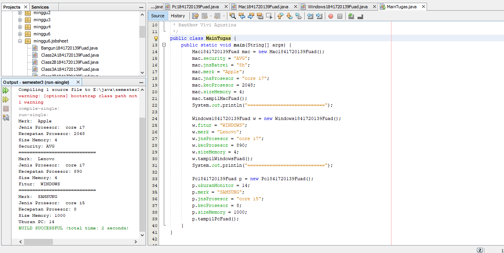

# Laporan Praktikum #4 - Inheritance

TRI FUAD
## Kompetensi

Setelah menempuh pokok bahasan ini, mahasiswa mampu: 
1. Memahami konsep inheritance
2. bisa menghubungkan class yang bebeda menggunakan prinsip parrent dan child

## Ringkasan Materi

untuk keseluruhan dalam menyelesaikan tugas yang di berikan dosen tidak ada masalah, mulai terbiasa dengan cara pengiriman 

## Percobaan

### Percobaan 1

 Class ClassA

Link kode program : 
[ClassA](../../src/6_Inheritance/ClassA1841720139Fuad.java)

Class ClassB

Link kode program : 
[ClassB](../../src/6_Inheritance/ClassB1841720139Fuad.java)

Class Percobaan1

Link kode program : 
[Percobaan1](../../src/6_Inheritance/Percobaan1.java)

### Pertanyaan
1. Pada	percobaan 1 diatas program yang dijalankan terjadi error, kemudian perbaiki sehingga program tersebut bisa dijalankan dan tidak error!
   
   Jawab :
   Tambah extends  public ClassB extends ClassA{ }
2. Jelaskan apa penyebab program pada percobaan 1 ketika dijalankan terdapat error!	
   
   Jawab :
   terjadi error karena tidak di deklarasikan z,y serta pada classB tidak di tambah i extends 

### Percobaan 2

Class ClassA

Link kode program : 
[ClassA](../../src/6_Inheritance/Class2A1841720139Fuad.java)

Class ClassB

Link kode program : 
[classB](../../src/6_Inheritance/Class2B1841720139Fuad.java)

Class Percobaan2

Link kode program : 
[Percobaan2](../src/6_Inheritance/Percobaan2.java)

### Pertanyaan
1. Pada	percobaan 2 diatas program yang dijalankan terjadi error, kemudian perbaiki sehingga program tersebut bisa dijalankan dan tidak error!	
   
   Jawab : 
    Tambah extends pada class B public ClassB extends ClassA{ }
2. Jelaskan apa penyebab program pada percobaan 1 ketika dijalankan terdapat error!	
   
   Jawab :
   Terjadi error karena tidak ada deklarasi atribut x dan y pada class B dan tidak ada extends pada class B 

  

### Percobaan 3

Class Bangun

Link kode program : 
[Bangun](../../src/6_Inheritance/Bangun1841720139Fuad.java)

Class Tabung 

Link kode program : 
[Tabung](../../src/6_Inheritance/Tabung1841720139Fuad.java)

Class Percobaan3

Link kode program : 
[Percobaan3](../../src/6_Inheritance/Percobaan3.java)

### Pertanyaan
1. Jelaskan fungsi “super” pada potongan program berikut di class Tabung!
   
   Jawab : 
    Untuk mempresentasikan object dari class induk 
2. Jelaskan fungsi “super” dan “this” pada potongan program berikut di class Tabung!
   
   Jawab :
   Fungsinya super untuk mengambil nilai dari kelas induk , sedangkan This untuk mempresentasikan object class itu sendiri  
3. Jelaskan mengapa pada class Tabung tidak dideklarasikan atribut “phi” dan “r” tetapi class tersebut dapat mengakses atribut tersebut!
   
   Jawab :
   Karena kelas tabung mengambil nilai object dari kelas Bangun. 
   
 
### Percobaan 4
Class ClassA

Link kode program : 
[ClassA](../../src/6_Inheritance/Class3A1841720139Fuad.java)

Class ClassB

Link kode program : 
[ClassB](../../src/6_Inheritance/Class3B1841720139Fuad.java)

Class ClassC

Link kode program : 
[ClassC](../../src/6_Inheritance/Class3C1841720139Fuad.java)

Class Percobaan4

Link kode program : 
[Percobaan4](../../src/6_Inheritance/Percobaan4.java)

### Pertanyaan

1.	Pada percobaan 4 sebutkan mana class yang termasuk superclass dan subclass, kemudian jelaskan alasannya!

    Jawab :
     Super Class Adalah ClassA  SubClass nya : ClassB , ClassC  Karena pada ClassB dan ClassC kita ketikkan Extends untuk mempresentasikan nilai dari induk Class 
1. Ubahlah	
  isi	
  konstruktor	
  default	
  ClassC	
  seperti	
  berikut:Tambahkan	
  kata	
  super()	
  di	
  baris	
  Pertaman	
  dalam	
  konstruktor	
  defaultnya.	
  Coba	
  jalankan	
   kembali	
  class	
  Percobaan4	
  dan	
  terlihat	
  tidak	
  ada	
  perbedaan	
  dari	
  hasil	
  outputnya!	
   
  
    Jawab :
     Tidak ada perubahan 
3. Ublah	
  isi	
  konstruktor	
  default	
  ClassC	
  seperti	
  berikut:	
  Ketika	
  mengubah	
  posisi	
  super()	
  dibaris	
  kedua	
  dalam	
  kontruktor	
  defaultnya	
  dan	
  terlihat	
  ada	
   error.	
  Kemudian	
  kembalikan	
  super()	
  kebaris	
  pertama	
  seperti	
  sebelumnya,	
  maka	
  errornya	
   akan	
  hilang.	
   Perhatikan	
  hasil	
  keluaran	
  ketika	
  class	
  Percobaan4	
  dijalankan.	
  Kenapa	
  bisa	
  tampil	
  output	
   seperti	
  berikut	
  pada	
  saat	
  instansiasi	
  objek	
  test	
  dari	
  class	
  ClassC	
Jelaskan	
  bagaimana	
  urutan	
  proses	
  jalannya	
  konstruktor	
  saat	
  objek	
  test	
  dibuat!	

    Jawab :
    Urutan konstrakter di awal i dari ClassA (superclass) isi dari Classa di tampilkan kemudian ClassB di mana kita tambahkan Extends untuk memanggil fungsi dari kelas lain isi dari ClassB di tampilkan , kemudian pada ClassC di ulangi seperti yang ada di ClassC dan isi dari ClassC di tampilkan atau di jalankan yang mana pada Percobaan4(main)  
 
4. Apakah	
  fungsi	
  super()	
  pada	
  potongan	
  program	
  dibawah	
  ini	
  di	
  ClassC!	
  

    Jawab : 
    Digunakan untuk memanggil method tertentu dari kelas induk.  

### Percobaan 5

 Class Karyawan

Link kode program : 
[Karyawan](../../src/6_Inheritance/Karyawan1841720139Fuad.java)

Class Manager

Link kode program : 
[Manager](../../src/6_Inheritance/Manager1841720139Fuad.java)

Class Staff

Link kode program : 
[Staff](../../src/6_Inheritance/Staff1841720139Fuad.java)

Class Percobaan5

Link kode program : 
[Percobaan5](../../src/6_Inheritance/Inheritance1.java)

### Pertanyaan
1. Sebutkan	
  class	
  mana	
  yang	
  termasuk	
  super	
  class	
  dan	
  sub	
  class	
  dari	
  percobaan	
  1	
  diatas!	
  

    Jawab :
    Super Class (Karyawan) sedangkan sub Class (Staff, Manager) dengan mengetikkan extends pada classnya dan di ikut i super classnya Karyawan  
2. Kata	
  kunci	
  apakah	
  yang	
  digunakan	
  untuk	
  menurunkan	
  suatu	
  class	
  ke	
  class	
  yang	
  lain?	
  

    Jawab :
    Dengan menggunakan Extends untuk menurunkan ke Class yang lainnya 
3. Perhatikan	
  kode	
  program	
  pada	
  class	
  Manager,	
  atribut	
  apa	
  saja	
  yang	
  dimiliki	
  oleh	
  class	
   tersebut?	
  Sebutkan	
  atribut	
  mana	
  saja	
  yang	
  diwarisi	
  dari	
  class	
  Karyawan!	
   

    Jawab :
    Pada ClassManager terdapat = attribut :int Tunjangan Attribut pada class Kariyawan = Gaji , yang akan di turunkan menjadi Tunjangan pada Class Manager 
4. Jelaskan	
  kata	
  kunci	
  super	
  pada	
  potongan	
  program	
  dibawah	
  ini	
  yang	
  terdapat	
  pada	
  class	
   Manager!	
 
    

    Jawab :
     Mewakili dari kelas induknya yaitu Gaji , sedangkan tunjangan mewakili kelas Manag
5. Program	
  pada	
  percobaan	
  1	
  diatas	
  termasuk	
  dalam	
  jenis	
  inheritance	
  apa?	
  Jelaskan	
   alasannya!
   

    Jawab :
     Multilevel Inheritance dikatakan seperti itu karena suatu sub class yang menjadi parent class untuk class lainnya. 

### Percobaan 6

Class StaffTetap

Link kode program : 
[StaffTetap](../../src/6_Inheritance/StaffTetap1841720139Fuad.java)

Class StaffHarian

Link kode program : 
[StaffHarian](../../src/6_Inheritance/StaffHarian1841720139Fuad.java)

Class Inheritance2

Link kode program : 
[Inheritace2](../../src/6_Inheritance/Inheritance2.java)

### Pertanyaan
1. Berdasarkan	
  class	
  diatas	
  manakah	
  yang	
  termasuk	
  single	
  inheritance	
  dan	
  mana	
  yang	
   termasuk	
  multilevel	
  inheritance?	
  
    
    Jawab :
    Single Inheritance = Percobaan 1 ClassA (Class B mewakili Class B , Class Tabung mewakili Class Tabung) Multilavel inheritance = Percobaan4 (Class B,C mewakili Class A, Class Manager, Staff mewakili Class Karyawan, Staffharian, Stafftetap mewakili Class Staff) 
2. Perhatikan	
  kode	
  program	
  class	
  StaffTetap	
  dan	
  StaffHarian,	
  atribut	
  apa	
  saja	
  yang	
  dimiliki	
  oleh	
   class	
  tersebut?	
  Sebutkan	
  atribut	
  mana	
  saja	
  yang	
  diwarisi	
  dari	
  class	
  Staff!	
   
    
    Jawab :
    Attribut Class StaffHarian = jumlah jam kerja yang mana attribut ini diwarisi oleh class karyawan (potongan) Attribut Class StaffTetap = golongan , asuransi yang mana attribut ini diwarisi oleh class karyawan (lembur) 
3. Apakah	
  fungsi	
  potongan	
  program	
  berikut	
  pada	
  class	
  StaffHarian	
    
    
    Jawab :
     Memanggil nilai dari dari variabel yang ada di dalam class induk (super class) 
4.  Apakah	
  fungsi	
  potongan	
  program	
  berikut	
  pada	
  class	
  StaffHarian	
     
    
    Jawab :
    Karena pada method tampilDatastaff(); menggunakan kata kunci super untuk mengambil nilai dari variable yang ada di jalam sub class 
9.  Perhatikan	
  kode	
  program	
  dibawah	
  ini	
  yang	
  terdapat	
  pada	
  class	
  StaffTetap 
Terlihat	
  dipotongan	
  program	
  diatas	
  atribut	
  gaji,	
  lembur	
  dan	
  potongan	
  dapat	
  diakses	
   langsung.	
  Kenapa	
  hal	
  ini	
  bisa	
  terjadi	
  dan	
  bagaimana	
  class	
  StaffTetap	
  memiliki	
  atribut	
  gaji,	
   lembur,	
  dan	
  potongan	
  padahal	
  dalam	
  class	
  tersebut	
  tidak	
  dideklarasikan	
  atribut	
  gaji,	
  lembur,	
   dan	
  potongan?	
      
    
    Jawab :
    Karena pada class StaffTetap kita menggunakan extands untuk memanggil isi yang terdapat didalam Class Staf yang mana isinya atribut gaji, lembur, dan potongan. 
  
  
  

## Tugas 
Class Komputer

Link kode program : 
[Komputer](../../src/6_Inheritance/Komputer1841720139Fuad.java)

Class Laptop

Link kode program : 
[Laptop](../../src/6_Inheritance/Laptop1841720139Fuad.java)

Class PC

Link kode program : 
[PC](../../src/6_Inheritance/Pc1841720139Fuad.java)

Class Mac

Link kode program : 
[Mac](../../src/6_Inheritance/Mac1841720139Fuad.java)

Class Windows

Link kode program : 
[WIndows](../../src/6_Inheritance/Widows1841720139Fuad.java)

Class MainTugas

Link kode program : 
[MainTugas](../../src/6_Inheritance/MainTugas.java)

## Kesimpulan

dari jobsheet inheritance saya lebih memahami operasi Parrent dan Child sedikit ada permaslahan tapi sudah terjawab.

## Pernyataan Diri

Saya menyatakan isi tugas, kode program, dan laporan praktikum ini dibuat oleh saya sendiri. Saya tidak melakukan plagiasi, kecurangan, menyalin/menggandakan milik orang lain.

Jika saya melakukan plagiasi, kecurangan, atau melanggar hak kekayaan intelektual, saya siap untuk mendapat sanksi atau hukuman sesuai peraturan perundang-undangan yang berlaku.

Ttd,

***(TRI FUAD)***