# Laporan Praktikum #4 - Inheritance

TRI FUAD
## Kompetensi
Setelah menempuh pokok bahasan ini, mahasiswa mampu : 
* a. Memahami konsep overloading dan overriding, 
* b. Memahami perbedaan overloading dan overriding, 
* c. Ketepatan dalam mengidentifikasi method overriding dan overloading 
* d. Ketepatan dalam mempraktekkan instruksi pada jobsheet 
* e. Mengimplementasikan method overloading dan overriding. 

## Ringkasan Materi

untuk keseluruhan dalam menyelesaikan tugas yang di berikan dosen tidak ada masalah, mulai terbiasa dengan cara pengiriman 

## Praktikum

### Percobaan 1

Class Karyawan
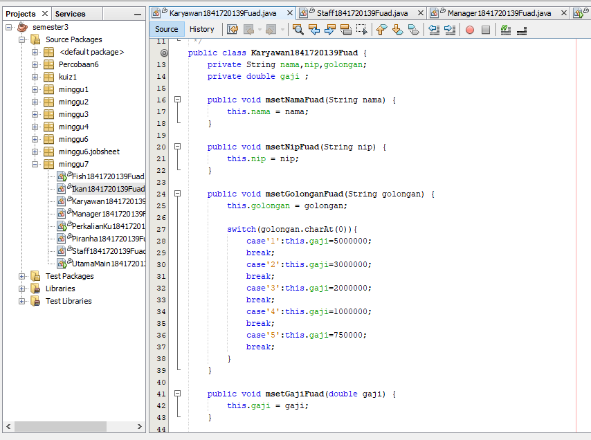
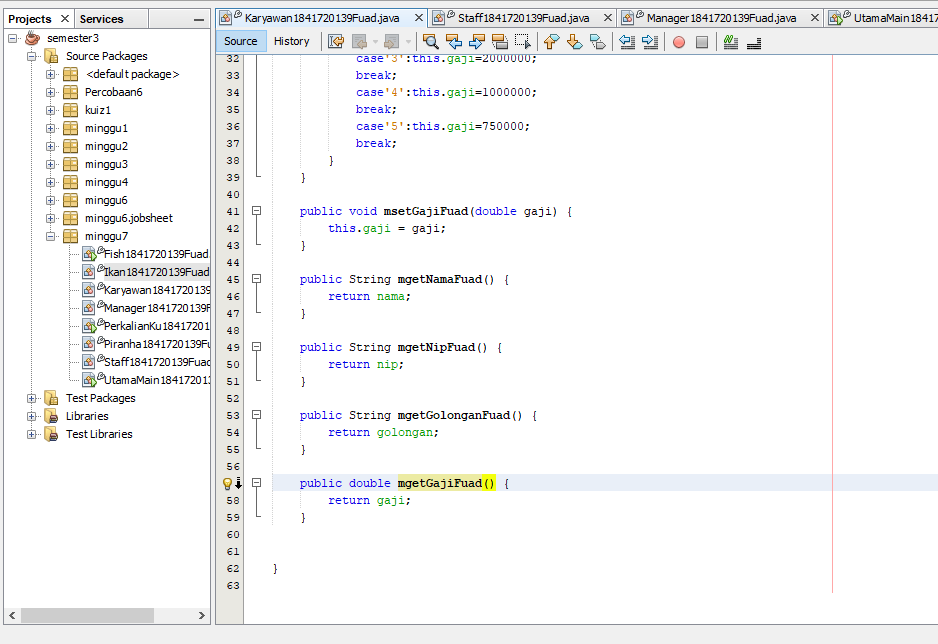

Link kode program : 
[Karyawan](../../src/7_Overriding_dan_Overloading/Karyawan1841720139Fuad.java)

Class Staff
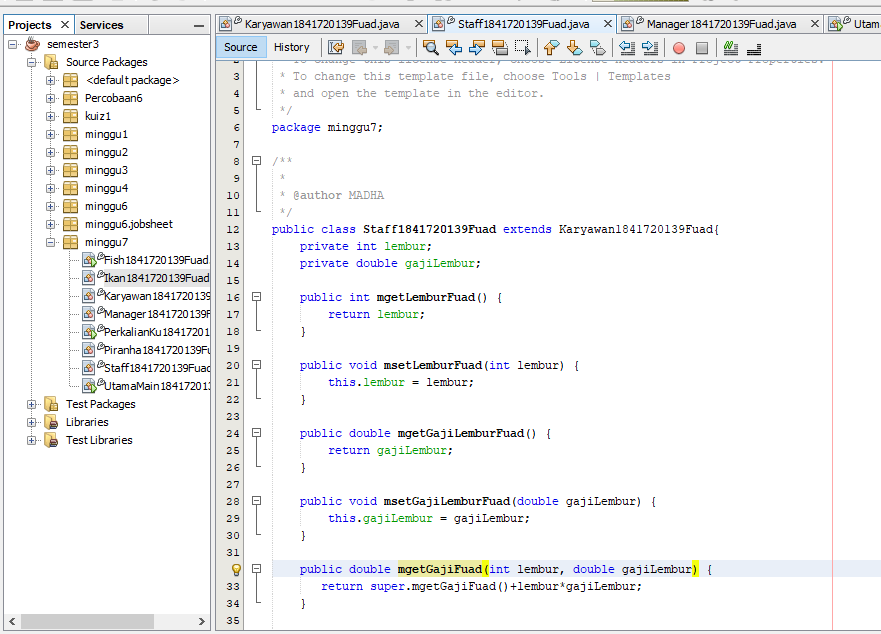
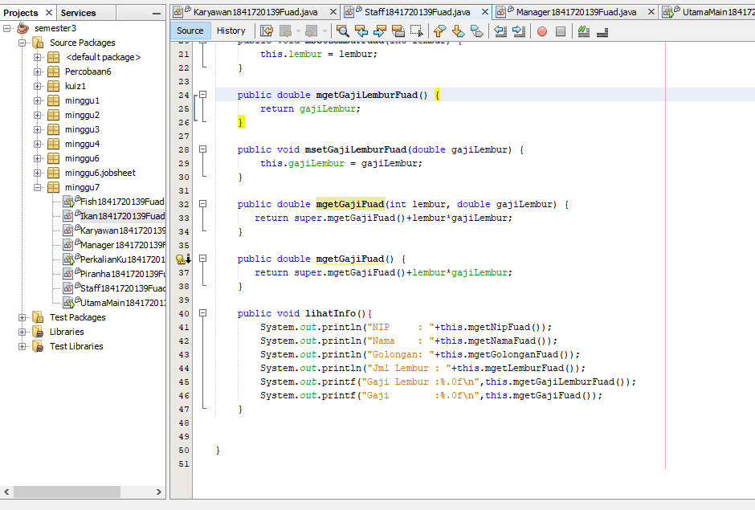

Link kode program : 
[Staff](../../src/7_Overriding_dan_Overloading/Staff1841720139Fuad.java)

Class Manager
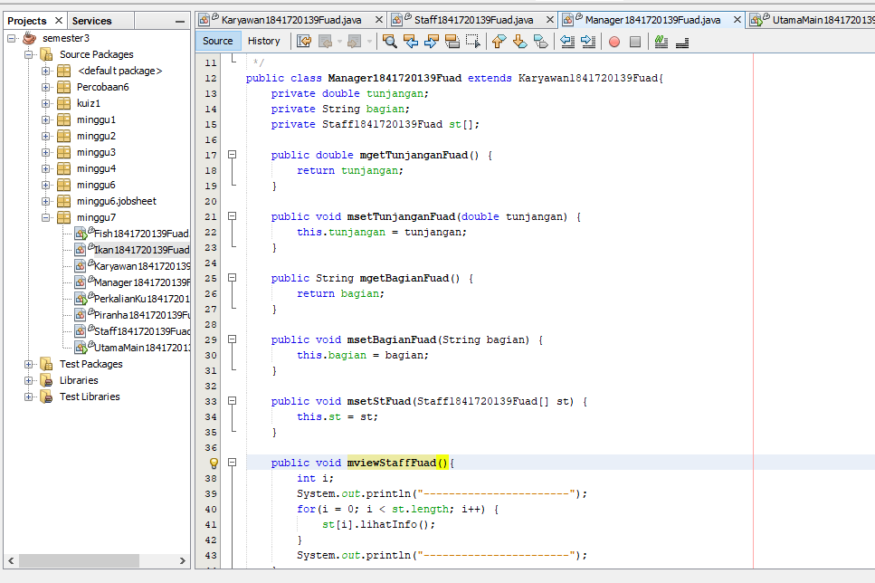
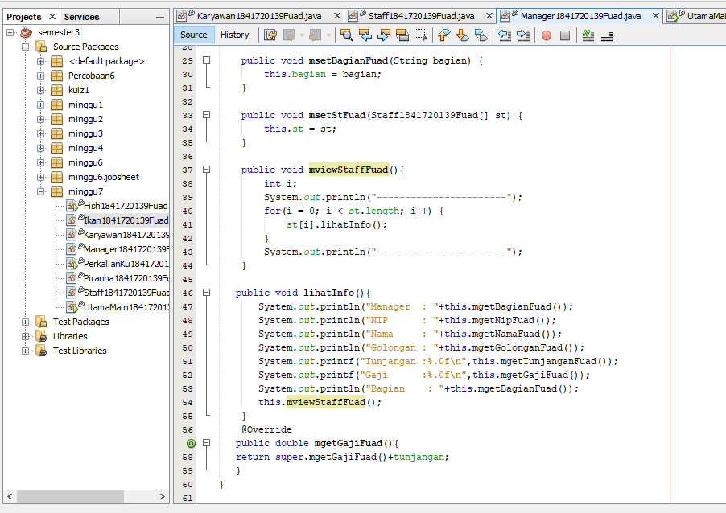

Link kode program : 
[Manager](../../src/7_Overriding_dan_Overloading/Manager1841720139Fuad.java)

Class UtamaMain
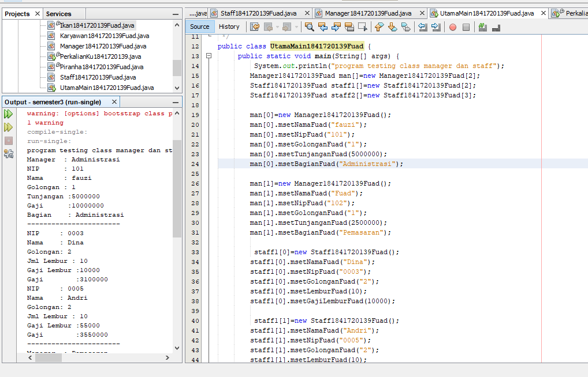
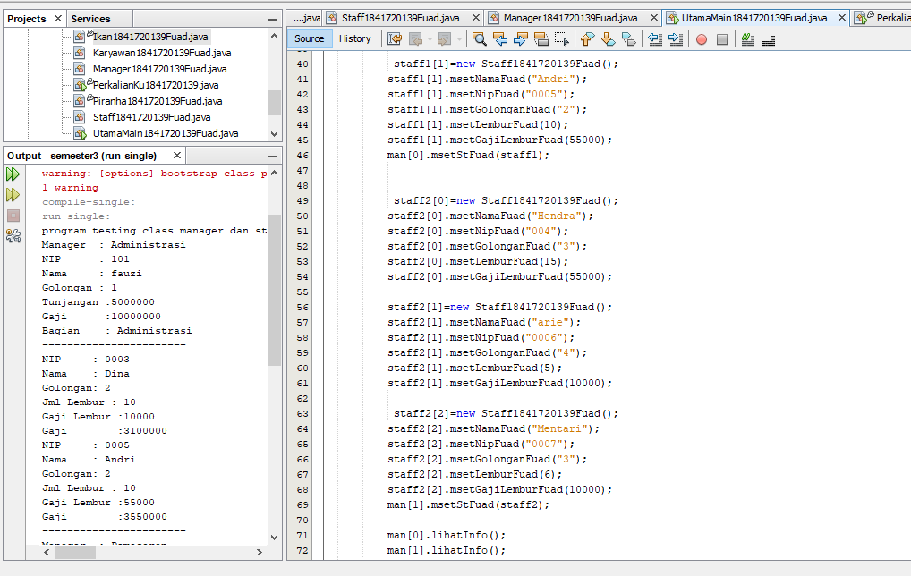

Untuk hasil running dari main yang lebih jelas
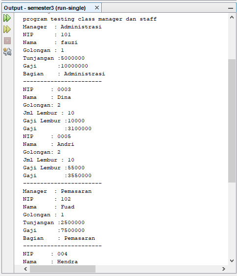
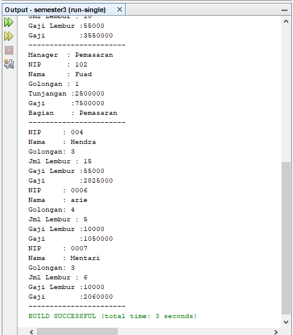
Link kode program : 
[Main](../../src/7_Overriding_dan_Overloading/UtamaMain1841720139Fuad.java)

### Latihan 
#### Latihan 1
Class PerkalianKu

untuk latian perkalianku saya jadikan satu agar tidak kerja dua kali
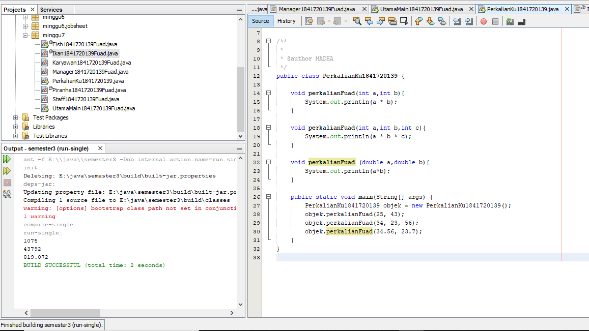

Link kode program : 
[PerkalianKu](../../src/7_Overriding_dan_Overloading/PerkalianKu1841720139.java)

1 Dari source coding diatas terletak dimanakah overloading?
    
Jawab : Terdapat 2 method overloading
    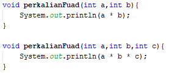

2 Jika terdapat overloading ada berapa jumlah parameter yang berbeda? 
   
Jawab : Berjumlah 1 yang berbeda parameter yaitu pada method perkalian yang pertama berparameter(int a, int b). sedangkan, method perkalian yang kedua berparameter (int a, int b, int c) 

3 Dari source coding diatas terletak dimanakah overloading?

Jawab : Terdapat 2 method overloading
    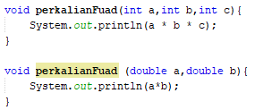

4 Jika terdapat overloading ada berapa jumlah parameter yang berbeda?

Jawab : Terdapat 1 parameter berbeda yang method overloading pertama menggunakan tipe parameter integer, sedangkan pada method overloading kedua menggunakan tipe parameter double, meskipun sama-sama berjumlah 2 parameter 

#### Latihan 2

Class Ikan
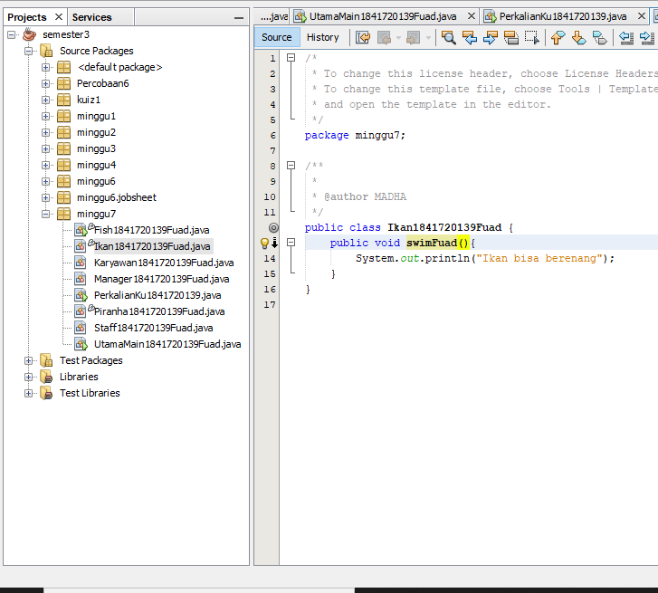

Link kode program : 
[Ikan](../../src/7_Overriding_dan_Overloading/Ikan1841720139Fuad.java)

Class Piranha
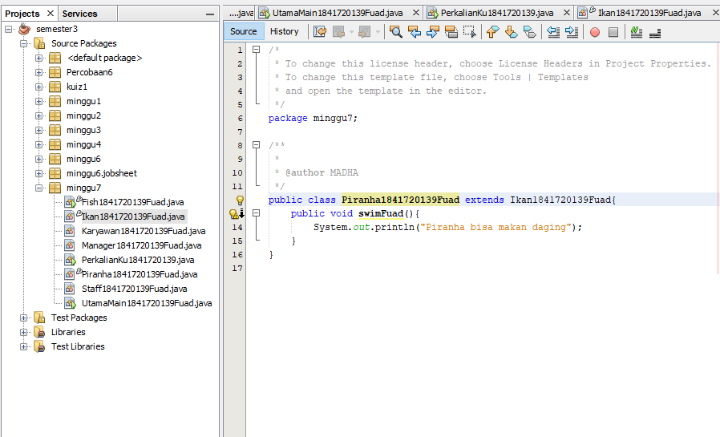

Link kode program : 
[Piranha](../../src/7_Overriding_dan_Overloading/Piranha1841720139Fuad.java)

Class FishMain
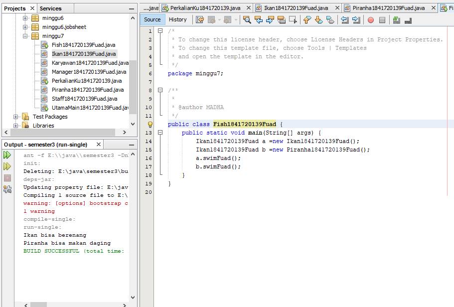

Link kode program : 
[Fish](../../src/7_Overriding_dan_Overloading/Fish1841720139Fuad.java)

1 Dari source coding diatas terletak dimanakah overloading?
    
Jawab : Terletak pada baris
    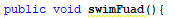

2 Jika terdapat overloading ada berapa jumlah parameter yang berbeda? 
   
Jawab : Terdapat overriding yaitu pada method swim() di class Piranha.  Disebut method overriding karena nama method tersebut sama dengan nama method di superclassnya namun berbeda di isi methodnya (dimodifikasi). 

## Tugas 

### Overloading
Class Segitiga
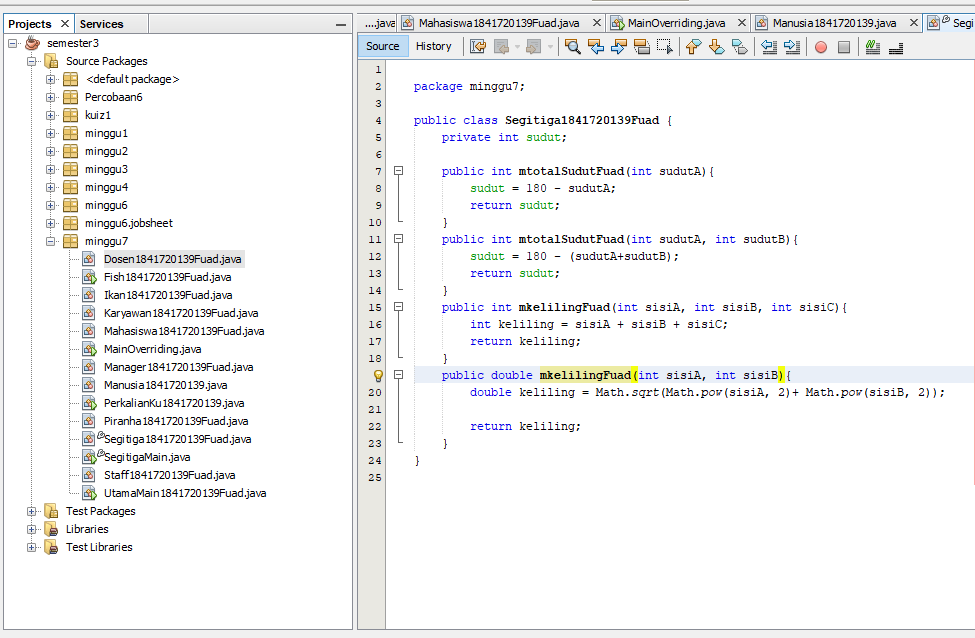

Link kode program : 
[segitiga](../../src/7_Overriding_dan_Overloading/Segitiga1841720139Fuad.java)

Class SegitigaMain

Link kode program : 
[SegitigaMain](../../src/7_Overriding_dan_Overloading/SegitigaMain.java)

### Overriding
Class Manusia
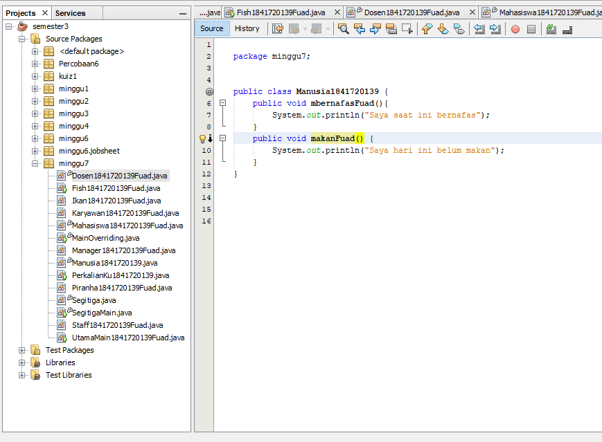

Link kode program : 
[Manusia](../../src/7_Overriding_dan_Overloading/Manusia1841720139.java)

Class Dosen
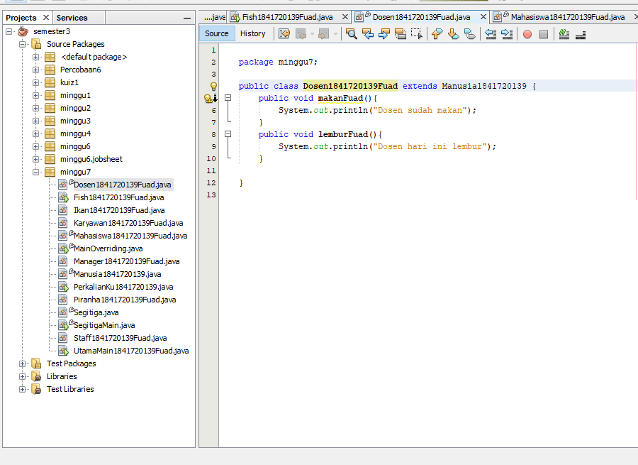

Link kode program : 
[Dosen](../../src/7_Overriding_dan_Overloading/Dosen1841720139Fuad.java)

Class Mahasiswa
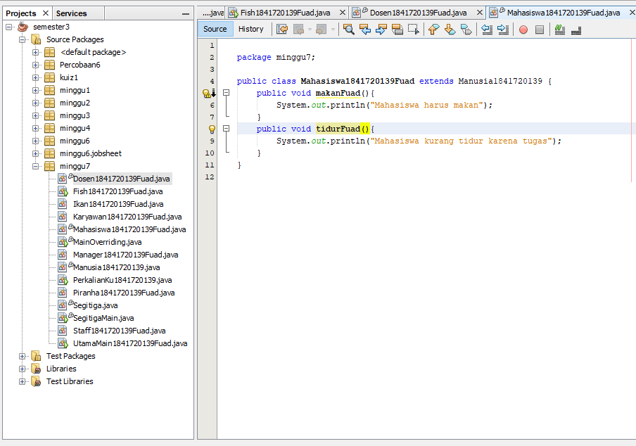

Link kode program : 
[Mahasiswa](../../src/7_Overriding_dan_Overloading/Mahasiswa1841720139Fuad.java)

Class MainTugas
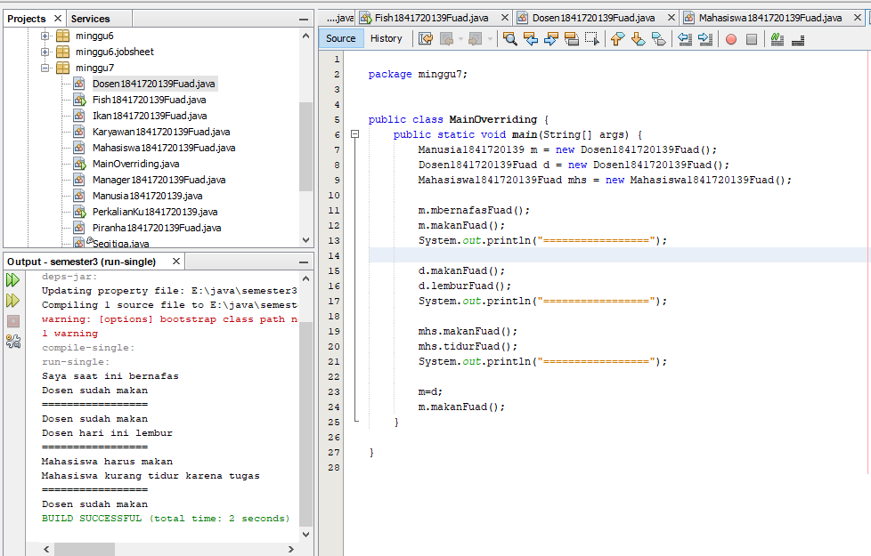

Link kode program : 
[MainTugas](../../src/7_Overriding_dan_Overloading/MainOverriding.java)

## Kesimpulan

dari jobsheet overloading dan overriding saya lebih paham dengan apa itu method ada yang ditumpuk dengan mebbunganan tipe data yang berbeda, dan memperdalam materi extends saya.

## Pernyataan Diri

Saya menyatakan isi tugas, kode program, dan laporan praktikum ini dibuat oleh saya sendiri. Saya tidak melakukan plagiasi, kecurangan, menyalin/menggandakan milik orang lain.

Jika saya melakukan plagiasi, kecurangan, atau melanggar hak kekayaan intelektual, saya siap untuk mendapat sanksi atau hukuman sesuai peraturan perundang-undangan yang berlaku.

Ttd,

***(TRI FUAD)***