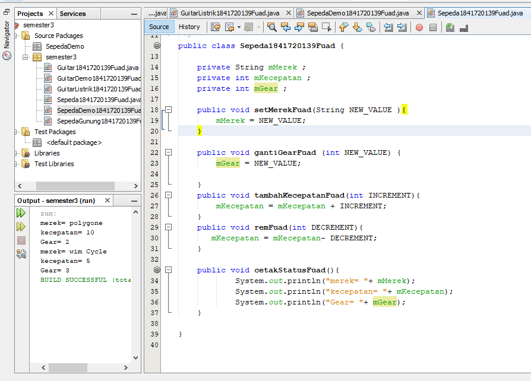
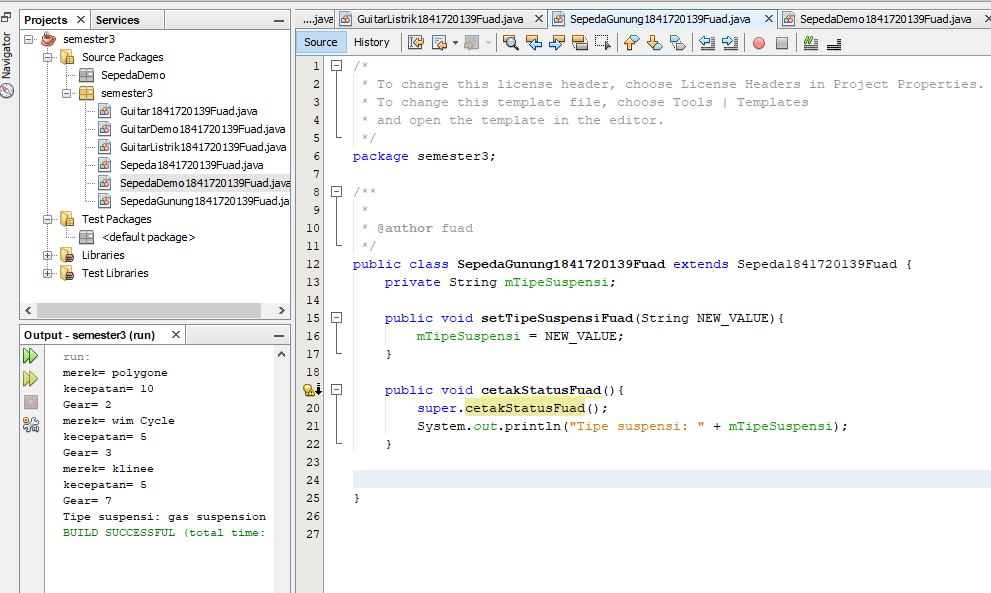
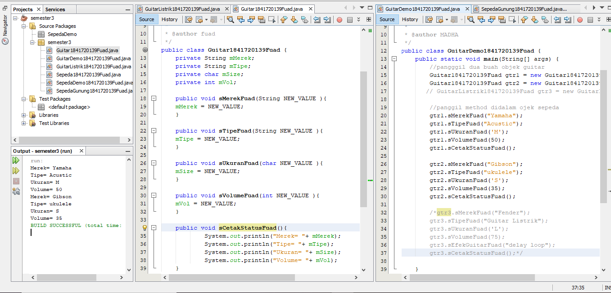
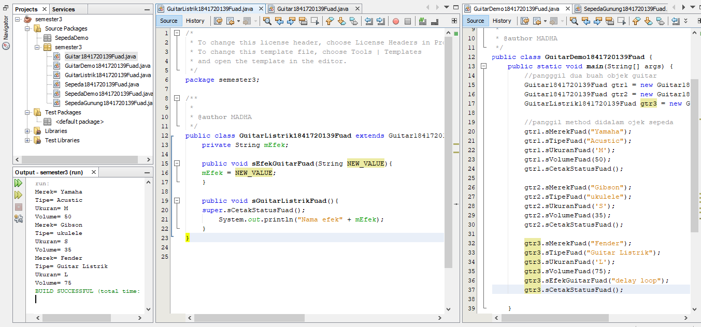

# Laporan Praktikum #1 - Pengantar Konsep PBO

## Kompetensi

(ketiklah kompetensi tiap praktikum di sini)

## Ringkasan Materi

(berisi catatan penting pribadi selama praktikum berlangsung ataupun menemukan permasalahan khusus saat melakukan percobaan)

## Percobaan

### Percobaan 1

(berisi penjelasan percobaan 1. Jika ada rujukan ke file program, bisa dibuat linknya di sini.)

`contoh screenshot yang benar, menampilkan 3 komponen, yaitu struktur project, kode program, dan hasil kompilasi`

Contoh link kode program : [kode program Sepeda1841720139Fuad](../../src/1_Pengantar_Konsep_PBO/Sepeda1841720139Fuad.java)

[kode program SepedaDemo1841720139Fuad](../../src/1_Pengantar_Konsep_PBO/SepedaDemo1841720139Fuad.java)

### Percobaan 2

(berisi penjelasan percobaan 2. Jika ada rujukan ke file program, bisa dibuat linknya di sini.)

`contoh screenshot yang benar, menampilkan 3 komponen, yaitu struktur project, kode program, dan hasil kompilasi`

Contoh link kode program : [kode program SepedaGunung184120139Fuad](../../src/1_Pengantar_Konsep_PBO/SepedaGunung1841720139Fuad.java)

[kode program SepedaDemo1841720139Fuad](../../src/1_Pengantar_Konsep_PBO/SepedaDemo1841720139Fuad.java)

## Pertanyaan

(1. Sebutkan dan jelaskan aspek-aspek yang ada pada pemrograman berorientasi objek!
Jawab: Object adalah suatu rangkaian dalam program yang terdiri dari state dan behaviour. Object pada software dimodelkan sedemikian rupa sehingga mirip dengan objek yang ada di dunia nyata.

Class  adalah blueprint atau prototype dari objek. Ambil contoh objek sepeda. Terdapat berbagai macam sepeda di dunia, dari berbagai merk dan model. 

Enkapsulasi Disebut juga dengan information-hiding. Dalam berinteraksi dengan objek, seringkali kita tidak perlu mengetahui kompleksitas yang ada didalamnya

Inheritance Disebut juga pewarisan. Inheritance memungkinkan kita untuk mengorganisir struktur program dengan natural. Inheritance juga memungkinkan kita untuk memperluas fungsionalitas program tanpa harus mengubah banyak bagian program. Contoh di dunia nyata, objek sepeda dapat diturunkan lagi ke model yang lebih luas, misal sepeda gunung (mountain bike) dan road bike.

Polimorfisme Polimorfisme juga meniru sifat objek di dunia nyata, dimana sebuah objek dapat memiliki bentuk, atau menjelma menjadi bentuk-bentuk lain. Misalkan saja objek pesawat terbang. Objek ini dapat diwariskan menjadi pesawat jet dan pesawat baling-baling. Keduanya memiliki kemampuan untuk menambah kecepatan. Namun secara teknis, metode penambahan kecepatan antara pesawat jet dengan baling-baling tentu berbeda, karena masing-masing memiliki jenis mesin yang berbeda. 

 2. Apa yang dimaksud dengan object dan apa bedanya dengan class?
 Jawab:class adalah kumpulan atas definisi data dan fungsi fungsi dalam suatu unit.

 Object ialah membungkus data dan fungsi bersama menjadi suatu unit dalam sebuah program komputer, objek merupakan dasar dari modularitas dan struktur dalam sebuah program komputer berorientasi objek 

 3. Sebutkan salah satu kelebihan utama dari pemrograman
 berorientasi objekdibandingkan dengan pemrograman struktural!
 Jawab: Adanya  konsistensi karena sifat inhantance dan penggunaan fase yang sama pada saat menganalisis,merancang maupun coding

  4. Pada class Sepeda, terdapat state/atribut apa saja?
   Jawab: Decrement,increment,newValue

  5. Tambahkan atribut warna pada class Sepeda.
   Jawab:E:\java\semester3\src\semester3
  6. Mengapa pada saat kita membuat class SepedaGunung, kita tidak perlu membuat class nya dari nol?
  Jawab: Karena kita sudah memanggil fungsi dari extands yang terdapat pada SepedaGunung
   )

## Tugas

(silakan kerjakan tugas di sini beserta `screenshot` hasil kompilasi program. Jika ada rujukan ke file program, bisa dibuat linknya di sini.)

`contoh screenshot yang benar, menampilkan 3 komponen, yaitu struktur project, kode program, dan hasil kompilasi`

Contoh link kode program : [kode program Guitar1841720139Fuad](../../src/1_Pengantar_Konsep_PBO/Guitar1841720139Fuad.java)

[kode program GuitarListrik1841720139Fuad](../../src/1_Pengantar_Konsep_PBO/GuitarListrik1841720139Fuad.java)

[kode program GuitarDemo1841720139Fuad](../../src/1_Pengantar_Konsep_PBO/GuitarDemo1841720139Fuad.java)

## Kesimpulan

(yang saya dapat dari praktikum jobsheet1 adalah saya memanggil dan menambahkan program baru pada satu main)

## Pernyataan Diri

Saya menyatakan isi tugas, kode program, dan laporan praktikum ini dibuat oleh saya sendiri. Saya tidak melakukan plagiasi, kecurangan, menyalin/menggandakan milik orang lain.

Jika saya melakukan plagiasi, kecurangan, atau melanggar hak kekayaan intelektual, saya siap untuk mendapat sanksi atau hukuman sesuai peraturan perundang-undangan yang berlaku.

Ttd,

***(TRI FUAD)***